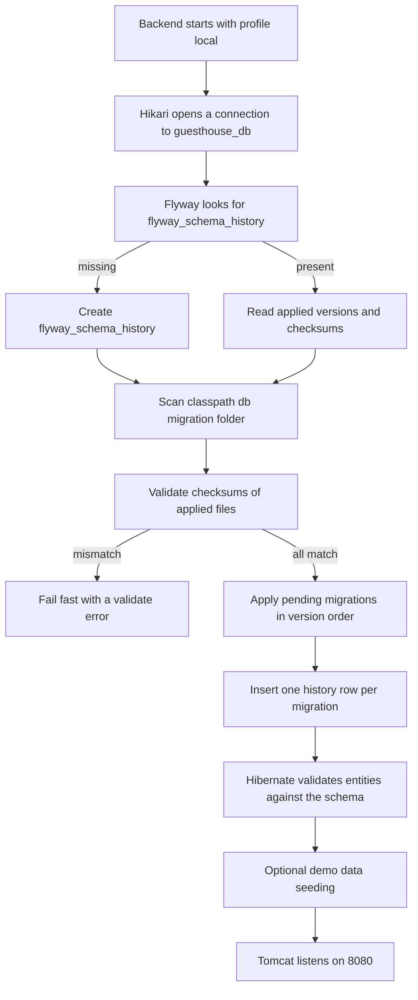

# Local Database Setup — PostgreSQL for Guest House Manager

Everything about the local PostgreSQL server that Guest House Manager talks to: installing and verifying the service, creating `guesthouse_db` and `guesthouse_test_db`, deciding between the `postgres` superuser and a dedicated `guesthouse_app` role, supplying the password through an environment variable, letting Flyway build the schema on backend start, inspecting and backing up the data, resetting from scratch, and fixing the six connection failures you will actually hit. Names, types, encoding and timezone rules here are the ones fixed in [conventions](conventions.md) §1, §4 and §5 — this guide never invents a table, column or database name of its own.

> **There is no cloud database and no Docker container anywhere in this project.** PostgreSQL runs as an ordinary Windows service (or `brew services` / `systemd` unit) on the same machine as the backend. No managed instance, no RDS, no Supabase, no Neon, no `docker run postgres`, no connection string that points anywhere except `localhost:5432`. Docker, cloud databases and production backup services are hard prohibitions in [conventions](conventions.md) §13 and appear only in [future-deployment-roadmap](future-deployment-roadmap.md).

---

## Table of contents

1. [Scope and what you need first](#1-scope-and-what-you-need-first)
2. [Install and verify the service](#2-install-and-verify-the-service)
3. [Connect with psql](#3-connect-with-psql)
4. [Create the development and test databases](#4-create-the-development-and-test-databases)
5. [Superuser or a dedicated role](#5-superuser-or-a-dedicated-role)
6. [The four required extensions](#6-the-four-required-extensions)
7. [Encoding, collation and timezone](#7-encoding-collation-and-timezone)
8. [Putting the password in an environment variable](#8-putting-the-password-in-an-environment-variable)
9. [Verify the exact connection the backend will use](#9-verify-the-exact-connection-the-backend-will-use)
10. [How Flyway creates the schema](#10-how-flyway-creates-the-schema)
11. [Inspecting tables with psql](#11-inspecting-tables-with-psql)
12. [psql meta-command reference](#12-psql-meta-command-reference)
13. [Backup and restore with pg_dump](#13-backup-and-restore-with-pg_dump)
14. [Resetting the database from scratch](#14-resetting-the-database-from-scratch)
15. [Connection troubleshooting](#15-connection-troubleshooting)
16. [What lives in the database folder](#16-what-lives-in-the-database-folder)

---

## 1. Scope and what you need first

| Item | Value | Source |
|---|---|---|
| Server | PostgreSQL 15 or newer, local service | [conventions](conventions.md) §2 |
| Host / port | `localhost` / `5432` | [conventions](conventions.md) §14 |
| Development database | `guesthouse_db` | [conventions](conventions.md) §1 |
| Test database | `guesthouse_test_db` | [conventions](conventions.md) §1 |
| Application role (recommended) | `guesthouse_app` | derived in §5 |
| Encoding | `UTF8` | [conventions](conventions.md) §4 |
| Session timezone | `UTC` | [conventions](conventions.md) §5 |
| Schema owner | Flyway 10.x, migrations in `guesthouse-api/src/main/resources/db/migration` | [conventions](conventions.md) §2 |
| Migration file naming | `V<seq>__<snake_case_description>.sql`, seq zero-padded to 3 digits | [conventions](conventions.md) §3 |

If PostgreSQL is not installed yet, do [local-setup](local-setup.md) §7 first — that section covers the installer choices. This guide picks up from a running service.

**Why 15 and not 13 or 14.** Three things depend on it: `gen_random_uuid()` without an extension fallback, *trusted* extensions so the application role can install `pgcrypto`, `btree_gist`, `pg_trgm` and `unaccent` without superuser rights (§6), and the PostgreSQL 15 `public`-schema ownership model that makes the dedicated-role setup in §5 clean.

---

## 2. Install and verify the service

Check the service exists and is running:

```powershell
Get-Service -Name "postgresql*" | Select-Object Name, Status, StartType
```

Expected: one row, `Status = Running`, `StartType = Automatic`. The name encodes the version, e.g. `postgresql-x64-17`.

Start it if it is stopped (needs an **elevated** PowerShell):

```powershell
Start-Service -Name "postgresql-x64-17"
```

Make sure it comes back after a reboot:

```powershell
Set-Service -Name "postgresql-x64-17" -StartupType Automatic
```

Confirm the port is listening:

```powershell
Test-NetConnection -ComputerName localhost -Port 5432 -InformationLevel Quiet -WarningAction SilentlyContinue
```

Expected: `True`. On a machine where PostgreSQL has never been installed this returns `False` — that is the check from [local-setup](local-setup.md) §2 and it is the fastest way to tell "not installed" from "installed but stopped".

See exactly which process holds the port:

```powershell
Get-NetTCPConnection -LocalPort 5432 -State Listen | Select-Object LocalAddress, OwningProcess
```

Confirm the client tools are on your PATH:

```powershell
psql --version
```

### macOS / Linux

macOS:

```bash
brew services list | grep postgres
```

```bash
brew services start postgresql@17
```

Linux:

```bash
systemctl status postgresql
```

```bash
sudo systemctl enable --now postgresql
```

Either platform:

```bash
pg_isready --host=localhost --port=5432
```

Expected: `localhost:5432 - accepting connections`.

---

## 3. Connect with psql

`psql` is the official command-line client. Everything in this guide can be done with it; pgAdmin 4 is an optional convenience and never required.

Connect as the superuser to the built-in `postgres` database:

```powershell
psql --host=localhost --port=5432 --username=postgres --dbname=postgres
```

You will be prompted for the password you chose during installation. The prompt becomes `postgres=#` — the `#` means superuser. A `>` instead means a non-superuser role.

Connect as the application role to the application database:

```powershell
psql --host=localhost --port=5432 --username=guesthouse_app --dbname=guesthouse_db
```

Confirm who and where you are:

```sql
\conninfo
```

Leave:

```sql
\q
```

Run a single statement without entering the interactive shell — useful in scripts:

```powershell
psql --host=localhost --port=5432 --username=postgres --dbname=postgres --command="SELECT version();"
```

Run a whole file:

```powershell
psql --host=localhost --port=5432 --username=postgres --dbname=postgres --file=D:\Project\SotSambanGuestHouse\database\01_create_databases.sql
```

Stop on the first error instead of ploughing on — always use this for schema scripts:

```powershell
psql --host=localhost --port=5432 --username=postgres --dbname=postgres --set=ON_ERROR_STOP=1 --file=D:\Project\SotSambanGuestHouse\database\01_create_databases.sql
```

macOS / Linux, where the OS user `postgres` maps to the superuser via peer authentication:

```bash
sudo -u postgres psql
```

> **A note on the connection URL.** The backend builds its JDBC URL from the environment variables in [conventions](conventions.md) §14 — `jdbc:postgresql://${DB_HOST}:${DB_PORT}/${DB_NAME}`. So `localhost`, `5432` and `guesthouse_db` in your `psql` command and in `guesthouse-api/.env` must agree exactly. If `psql` cannot connect with a set of values, the backend will not connect with them either — always debug in `psql` first.

---

## 4. Create the development and test databases

Two databases, never one. The tests **truncate and rebuild** their schema; pointing them at `guesthouse_db` would destroy your working data.

Connect as the superuser:

```powershell
psql --host=localhost --port=5432 --username=postgres --dbname=postgres
```

Create the development database:

```sql
CREATE DATABASE guesthouse_db WITH ENCODING 'UTF8' LC_COLLATE 'C' LC_CTYPE 'C' TEMPLATE template0;
```

Create the test database:

```sql
CREATE DATABASE guesthouse_test_db WITH ENCODING 'UTF8' LC_COLLATE 'C' LC_CTYPE 'C' TEMPLATE template0;
```

Why each clause is there:

| Clause | Reason |
|---|---|
| `ENCODING 'UTF8'` | Mandatory. Guest names, addresses and notes are stored in Khmer as well as English, and [conventions](conventions.md) §34 requires Khmer from day one. A `WIN1252` database silently mangles them. |
| `TEMPLATE template0` | You may only specify an encoding different from the cluster default when cloning `template0`. On Windows the installer's "Default locale" often produces a `WIN1252` cluster, so this clause is what makes the UTF8 request legal instead of an error. |
| `LC_COLLATE 'C'` / `LC_CTYPE 'C'` | The `C` locale is compatible with any encoding, so this combination always succeeds regardless of what Windows locale the cluster was built with. The cost is that `ORDER BY` on text is byte-order rather than dictionary-order. That is an accepted local-development trade-off: list sorting that must be human-ordered is done on indexed, normalised columns, and `unaccent` + `pg_trgm` handle search. **(new, derived)** |

Verify what you actually got:

```sql
SELECT datname, pg_encoding_to_char(encoding) AS encoding, datcollate, datctype FROM pg_database WHERE datname LIKE 'guesthouse%';
```

Expected: two rows, `encoding = UTF8`.

If either row shows something other than `UTF8`, drop and recreate that database now — before Flyway runs — using §14.

---

## 5. Superuser or a dedicated role

You have two workable choices for the credentials in `DB_USERNAME` / `DB_PASSWORD`.

### 5.1 Option A — reuse the `postgres` superuser

This is what `.env.example` ships with, because it is the one thing guaranteed to exist on a fresh install.

```sql
ALTER DATABASE guesthouse_db OWNER TO postgres;
```

Then in `guesthouse-api/.env`:

```env
DB_USERNAME=postgres
DB_PASSWORD=<the password you set during installation>
```

Nothing else to do. It always works, and it is the right answer for a five-minute smoke test.

### 5.2 Option B — a dedicated `guesthouse_app` role — **recommended**

Connected as the superuser:

```sql
CREATE ROLE guesthouse_app WITH LOGIN PASSWORD 'change_this_local_password';
```

Give it ownership of both databases:

```sql
ALTER DATABASE guesthouse_db OWNER TO guesthouse_app;
```

```sql
ALTER DATABASE guesthouse_test_db OWNER TO guesthouse_app;
```

Belt and braces for the `public` schema — connect to the application database first:

```sql
\connect guesthouse_db
```

```sql
ALTER SCHEMA public OWNER TO guesthouse_app;
```

Repeat for the test database:

```sql
\connect guesthouse_test_db
```

```sql
ALTER SCHEMA public OWNER TO guesthouse_app;
```

Confirm:

```sql
SELECT rolname, rolsuper, rolcreatedb, rolcanlogin FROM pg_roles WHERE rolname IN ('postgres', 'guesthouse_app');
```

Expected: `guesthouse_app` has `rolsuper = f` and `rolcanlogin = t`.

Then in `guesthouse-api/.env`:

```env
DB_USERNAME=guesthouse_app
DB_PASSWORD=change_this_local_password
```

### 5.3 Why the dedicated role is recommended

1. **A bug cannot reach outside its own database.** A superuser connection can `DROP DATABASE`, read every other database on the cluster, write files through `COPY TO PROGRAM`, and disable row security. `guesthouse_app` can do none of that. A mistake in a migration or a badly-scoped `DELETE` stays inside `guesthouse_db`.
2. **It is the same shape as any future real deployment.** When this system eventually leaves the office machine, it will have an application role — not a superuser. Developing against the same privilege level means you find "permission denied for schema public" now, on your own machine, instead of on the day it matters.
3. **PostgreSQL 15 makes it easy.** Since 15, the `public` schema is owned by the implicit role `pg_database_owner` and `CREATE` is revoked from `PUBLIC`. Simply making `guesthouse_app` the **database owner** therefore grants it everything Flyway needs — no long `GRANT` list to maintain. This is exactly why we require 15+.
4. **The four extensions still install.** In PostgreSQL 13+ `pgcrypto`, `btree_gist`, `pg_trgm` and `unaccent` are all marked *trusted*, which means the database owner may `CREATE EXTENSION` without being superuser (§6). Historically this was the reason people gave up and used `postgres`; it is no longer a reason.
5. **The password in `.env` is not your cluster master password.** If you paste your `.env` into a chat window by accident, you have leaked a local application password, not the key to the whole server.

The only cost is the two extra `ALTER DATABASE` statements above.

### 5.4 macOS / Linux

Same SQL. Reach the prompt with:

```bash
sudo -u postgres psql
```

---

## 6. The four required extensions

[conventions](conventions.md) §4 requires exactly four:

| Extension | Needed for |
|---|---|
| `pgcrypto` | `gen_random_uuid()` for every primary key, plus digest helpers |
| `btree_gist` | `uuid` equality inside the GiST exclusion constraint `ex_reservation_rooms__no_overlap`, which is what physically prevents double bookings |
| `pg_trgm` | Trigram indexes behind global search and guest name search |
| `unaccent` | Accent-insensitive search |

**You normally do not run these by hand.** The first Flyway migration creates them when the backend starts (§10), and because all four are trusted extensions on PostgreSQL 13+, the `guesthouse_app` database owner is allowed to do it.

If you need to create them manually — for example you are on a cluster where an administrator has marked them untrusted — connect to `guesthouse_db` as the **superuser** and run the helper script:

```powershell
psql --host=localhost --port=5432 --username=postgres --dbname=guesthouse_db --set=ON_ERROR_STOP=1 --file=D:\Project\SotSambanGuestHouse\database\02_create_extensions.sql
```

Verify what is installed:

```sql
\dx
```

Or as a query:

```sql
SELECT extname, extversion FROM pg_extension ORDER BY extname;
```

Expected: `btree_gist`, `pg_trgm`, `pgcrypto`, `plpgsql`, `unaccent`. `plpgsql` is always there and is not our doing.

Do the same for `guesthouse_test_db` — the tests build the same schema and need the same extensions.

---

## 7. Encoding, collation and timezone

### 7.1 The rules

| Setting | Required value | Fixed by |
|---|---|---|
| Database encoding | `UTF8` | [conventions](conventions.md) §4 |
| `client_encoding` | `UTF8` | follows the database |
| Database `TimeZone` | `UTC` | [conventions](conventions.md) §5.1 |
| Storage of instants | `timestamptz`, always UTC | [conventions](conventions.md) §4 |
| Business dates | `date`, interpreted in the **property** timezone, default `Asia/Phnom_Penh` | [conventions](conventions.md) §5.2 |

The important consequence: the database does **not** know about `Asia/Phnom_Penh`. It stores UTC instants and naked dates. Turning "now" into a business date is done in Java, through the injected `Clock` and the property's timezone — never by the database, and never with `LocalDate.now()`. Keeping the server on UTC is what makes that safe.

### 7.2 Pin the timezone

Connected as superuser or as the database owner:

```sql
ALTER DATABASE guesthouse_db SET timezone TO 'UTC';
```

```sql
ALTER DATABASE guesthouse_test_db SET timezone TO 'UTC';
```

`ALTER DATABASE ... SET` takes effect on the **next** connection, so reconnect before verifying.

### 7.3 Verify

Reconnect, then:

```sql
SHOW timezone;
```

Expected: `UTC`.

```sql
SHOW server_encoding;
```

Expected: `UTF8`.

```sql
SHOW client_encoding;
```

Expected: `UTF8`.

All the settings that matter in one query:

```sql
SELECT name, setting, source FROM pg_settings WHERE name IN ('TimeZone','server_encoding','client_encoding','max_connections','port','shared_buffers');
```

Prove UTF8 round-trips Khmer correctly:

```sql
SELECT 'ផ្ទះសំណាក់សុតសំបួរ' AS khmer_text, length('ផ្ទះសំណាក់សុតសំបួរ') AS characters, octet_length('ផ្ទះសំណាក់សុតសំបួរ') AS bytes;
```

`characters` must be smaller than `bytes`, and the text must come back unchanged. If you see `?` or mojibake in a Windows console, that is your terminal's code page and not the database — check with the query above, whose numbers are code-page independent, or set the console to UTF-8:

```powershell
[Console]::OutputEncoding = [System.Text.Encoding]::UTF8
```

Prove the UTC behaviour:

```sql
SELECT now() AS utc_now, now() AT TIME ZONE 'Asia/Phnom_Penh' AS phnom_penh_wall_clock;
```

The second column must be 7 hours ahead of the first. That 7-hour gap is exactly the gap the backend has to reason about, which is why every business date goes through the `Clock`.

---

## 8. Putting the password in an environment variable

Two different passwords appear in two different places, and they are easy to confuse:

| Variable | Read by | Purpose |
|---|---|---|
| `DB_PASSWORD` | the backend, via `guesthouse-api/.env` and `spring.datasource.password` | how the application logs in |
| `PGPASSWORD` | `psql`, `pg_dump`, `pg_restore`, `createdb` | how the **command-line tools** log in without prompting |

Setting `PGPASSWORD` is what stops `psql` and `pg_dump` asking you to type a password every single time.

### 8.1 Windows — per session

Set it for the current terminal window only. It disappears when you close the window, which makes it the right choice while you are experimenting:

```powershell
$env:PGPASSWORD = "change_this_local_password"
```

Check it took:

```powershell
$env:PGPASSWORD
```

Now `psql` connects with no prompt:

```powershell
psql --host=localhost --port=5432 --username=guesthouse_app --dbname=guesthouse_db --command="SELECT current_user, current_database();"
```

Clear it again when you are done:

```powershell
Remove-Item Env:\PGPASSWORD
```

### 8.2 Windows — persistent

Writes to your user environment so every future terminal has it. Run once:

```powershell
[Environment]::SetEnvironmentVariable("PGPASSWORD", "change_this_local_password", "User")
```

The same call also works for the backend variables if you would rather use real environment variables than the `.env` file — OS environment variables take precedence over the `.env` import, as explained in [backend-setup](backend-setup.md) §7:

```powershell
[Environment]::SetEnvironmentVariable("DB_PASSWORD", "change_this_local_password", "User")
```

Read it back — note you must open a **new** terminal first, because a running process never sees a changed environment:

```powershell
[Environment]::GetEnvironmentVariable("PGPASSWORD", "User")
```

Remove it later by setting it to `$null`:

```powershell
[Environment]::SetEnvironmentVariable("PGPASSWORD", $null, "User")
```

Use `"User"` and never `"Machine"` for a password: `"Machine"` makes it readable by every account on the computer and requires an elevated shell.

### 8.3 The safer Windows alternative — `pgpass.conf`

A password in an environment variable is visible to anything running as you, and appears in process dumps. PostgreSQL's own answer is a password file, which the client tools read automatically. On Windows it lives at `%APPDATA%\postgresql\pgpass.conf`, one `host:port:database:user:password` line per entry:

```powershell
New-Item -ItemType Directory -Force -Path "$env:APPDATA\postgresql" | Out-Null
```

```powershell
Add-Content -Path "$env:APPDATA\postgresql\pgpass.conf" -Value "localhost:5432:guesthouse_db:guesthouse_app:change_this_local_password" -Encoding utf8
```

Add a second line for the test database:

```powershell
Add-Content -Path "$env:APPDATA\postgresql\pgpass.conf" -Value "localhost:5432:guesthouse_test_db:guesthouse_app:change_this_local_password" -Encoding utf8
```

With that file present, `psql` and `pg_dump` stop prompting and you never need `PGPASSWORD`.

### 8.4 macOS / Linux

Per session:

```bash
export PGPASSWORD="change_this_local_password"
```

Persistent, for zsh:

```bash
echo 'export PGPASSWORD="change_this_local_password"' >> ~/.zshrc
```

Persistent, for bash:

```bash
echo 'export PGPASSWORD="change_this_local_password"' >> ~/.bashrc
```

Password file — the mode is enforced, `psql` ignores the file if it is group- or world-readable:

```bash
echo "localhost:5432:guesthouse_db:guesthouse_app:change_this_local_password" >> ~/.pgpass
```

```bash
chmod 600 ~/.pgpass
```

Unset:

```bash
unset PGPASSWORD
```

> Never commit any of these values. `guesthouse-api/.env` is git-ignored and only `.env.example` is tracked ([conventions](conventions.md) §14). `pgpass.conf` and `~/.pgpass` live outside the repository entirely.

---

## 9. Verify the exact connection the backend will use

Do this before starting the backend. It takes ten seconds and eliminates the most common first-run failure.

Read the values out of your own `.env` so you are testing what the application will test:

```powershell
Get-Content D:\Project\SotSambanGuestHouse\guesthouse-api\.env | Select-String -Pattern '^DB_'
```

Now connect with exactly those values:

```powershell
psql --host=localhost --port=5432 --username=guesthouse_app --dbname=guesthouse_db --command="SELECT current_user AS connected_as, current_database() AS db, current_setting('TimeZone') AS tz, version();"
```

Four things must be true in the output:

1. `connected_as = guesthouse_app` (or `postgres` if you chose Option A)
2. `db = guesthouse_db`
3. `tz = UTC`
4. the version string says 15 or higher

Confirm the role can actually create objects — this is what Flyway will attempt:

```powershell
psql --host=localhost --port=5432 --username=guesthouse_app --dbname=guesthouse_db --command="CREATE TABLE zz_permission_probe(id int); DROP TABLE zz_permission_probe;"
```

Silent success means Flyway will work. `ERROR: permission denied for schema public` means you skipped the ownership statements in §5.2.

macOS / Linux — identical, with `psql` on the PATH already.

---

## 10. How Flyway creates the schema

**You never create a table by hand.** Flyway 10.x owns the schema, migrations are versioned SQL files inside the backend, and they run automatically on every backend start.



Key facts:

- Migrations live in `guesthouse-api/src/main/resources/db/migration`.
- File names follow `V<seq>__<snake_case_description>.sql` with a zero-padded 3-digit sequence, e.g. `V011__create_reservations.sql` ([conventions](conventions.md) §3).
- `V001` creates the four extensions from §6, so a brand-new empty database becomes a working one with no manual SQL at all.
- Each migration runs **once**, inside a transaction, in version order, and is recorded with a checksum.
- `spring.jpa.hibernate.ddl-auto` is `validate`. Hibernate compares the entities against the schema Flyway just built and refuses to start if they disagree. Hibernate never creates or alters a table.
- The `test` profile runs the same migrations against `guesthouse_test_db`, so a migration that is broken fails the test suite ([testing-guide](testing-guide.md) covers the migration tests).

### 10.1 What `flyway_schema_history` looks like

It is an ordinary table in the `public` schema of each database:

```sql
SELECT installed_rank, version, description, type, script, success, execution_time, installed_on FROM flyway_schema_history ORDER BY installed_rank;
```

Typical output:

| installed_rank | version | description | type | script | success | execution_time | installed_on |
|---|---|---|---|---|---|---|---|
| 1 | 001 | create extensions | SQL | `V001__create_extensions.sql` | t | 214 | 2026-07-27 03:11:02 |
| 2 | 002 | create properties | SQL | `V002__create_properties.sql` | t | 41 | 2026-07-27 03:11:02 |
| 3 | 003 | create users roles permissions | SQL | `V003__create_users_roles_permissions.sql` | t | 63 | 2026-07-27 03:11:02 |
| … | … | … | … | … | t | … | … |

Column meanings:

| Column | Meaning |
|---|---|
| `installed_rank` | The order migrations were actually applied in. Never reused. |
| `version` | The `<seq>` from the file name. Unique. |
| `description` | The `<snake_case_description>` with underscores turned into spaces. |
| `type` | `SQL` for our files. Flyway writes `BASELINE` or `DELETE` for its own bookkeeping rows. |
| `script` | The exact file name. Rename a file and validation breaks. |
| `checksum` | A hash of the file contents. This is what makes editing an applied migration fatal. |
| `installed_by` | The database role that applied it — `guesthouse_app` if you followed §5.2. |
| `execution_time` | Milliseconds. |
| `success` | `t` or `f`. A single `f` row blocks all further migrations until you clear it (§15 and [backend-setup](backend-setup.md) §12). |

The fastest health check, without opening a shell:

```powershell
psql --host=localhost --port=5432 --username=guesthouse_app --dbname=guesthouse_db --command="SELECT count(*) AS applied, max(version) AS latest, bool_and(success) AS all_ok FROM flyway_schema_history;"
```

`all_ok = t` and `latest` matching the highest `V###` file in the repository means the schema is current.

Never `INSERT`, `UPDATE` or hand-edit rows in this table except the one documented failure recovery in [backend-setup](backend-setup.md) §12.4.

---

## 11. Inspecting tables with psql

Open a session:

```powershell
psql --host=localhost --port=5432 --username=guesthouse_app --dbname=guesthouse_db
```

List every table — after a first successful start you should see the ~49 tables of [conventions](conventions.md) §12 / the brief's table list, plus `flyway_schema_history`:

```sql
\dt
```

With sizes and descriptions:

```sql
\dt+
```

Full detail on one table — columns, types, defaults, indexes, constraints, foreign keys and the triggers:

```sql
\d+ reservations
```

Reading that output for `reservations` is the quickest way to internalise the conventions:

- `id uuid not null default gen_random_uuid()` — the surrogate key rule
- `property_id uuid not null` with `fk_reservations__properties` — the property-scoping rule
- `created_at`, `created_by`, `updated_at`, `updated_by`, `deleted_at`, `version` — the common columns of [conventions](conventions.md) §4
- `status character varying(40)` with `ck_reservations__status` listing the eight `ReservationStatus` values — enums as `varchar` + `CHECK`, never a PostgreSQL `ENUM` type
- `ck_reservations__departure_after_arrival` — the half-open date range rule
- money columns as `numeric(14,2)`

See the exclusion constraint that stops double bookings:

```sql
\d+ reservation_rooms
```

Look for `ex_reservation_rooms__no_overlap` of type `EXCLUDE USING gist`. That constraint, not any Java code, is the last line of defence for business rule 1.

List indexes:

```sql
\di+
```

List roles:

```sql
\du
```

List installed extensions:

```sql
\dx
```

Show the definition of a view:

```sql
\d+ v_room_availability
```

Turn on expanded output so a wide row prints one field per line — essential when reading a single reservation:

```sql
\x on
```

Then, for example:

```sql
SELECT * FROM reservations ORDER BY created_at DESC LIMIT 1;
```

Time your queries while you are checking an index:

```sql
\timing on
```

See a query plan:

```sql
EXPLAIN ANALYZE SELECT * FROM reservations WHERE property_id = (SELECT id FROM properties LIMIT 1) AND arrival_date >= CURRENT_DATE;
```

Row counts across the seeded tables, to confirm the demo data landed:

```sql
SELECT 'properties' AS t, count(*) FROM properties UNION ALL SELECT 'room_types', count(*) FROM room_types UNION ALL SELECT 'rooms', count(*) FROM rooms UNION ALL SELECT 'users', count(*) FROM users UNION ALL SELECT 'guests', count(*) FROM guests UNION ALL SELECT 'reservations', count(*) FROM reservations ORDER BY 1;
```

With `SEED_DEMO_DATA=true` expect 1 property, 6 room types, 20 rooms, 10+ users, 50 guests and 30 reservations.

> **Remember soft delete.** Almost every business table has `deleted_at`. A row with a non-null `deleted_at` is invisible to the application but still present here. Always add `WHERE deleted_at IS NULL` when you are checking whether the app "lost" something ([conventions](conventions.md) §4).

---

## 12. psql meta-command reference

Meta-commands start with a backslash, take no semicolon, and are handled by `psql` itself rather than the server.

| Command | What it does |
|---|---|
| `\?` | Help for all meta-commands |
| `\h CREATE TABLE` | SQL syntax help for a specific statement |
| `\conninfo` | Which database, user, host, port and socket you are on |
| `\l` | List databases |
| `\l guesthouse*` | List databases matching a pattern |
| `\c guesthouse_test_db` | Switch to another database in the same session |
| `\c - postgres` | Reconnect to the same database as a different role |
| `\dn` | List schemas |
| `\dt` | List tables in the search path |
| `\dt+` | …with size on disk and comments |
| `\dt public.*` | Tables in a named schema |
| `\d reservations` | Columns, indexes and constraints of one table |
| `\d+ reservations` | …plus storage, statistics targets and comments |
| `\di` / `\di+` | List indexes |
| `\dv` | List views |
| `\ds` | List sequences |
| `\df` | List functions |
| `\du` | List roles and their attributes |
| `\dx` | List installed extensions |
| `\dp reservations` | Show table privileges |
| `\sf function_name` | Print a function's source |
| `\x` / `\x on` / `\x off` | Toggle expanded one-field-per-line output |
| `\timing on` | Report the duration of every statement |
| `\pset null '[null]'` | Make NULLs visible instead of blank |
| `\pset pager off` | Stop paging long output — helpful in Windows Terminal |
| `\i path\to\file.sql` | Execute a file inside the current session |
| `\o out.txt` | Redirect query output to a file; `\o` alone stops |
| `\copy (SELECT * FROM rooms) TO 'rooms.csv' CSV HEADER` | Client-side CSV export, no server file permissions needed |
| `\e` | Open the last query in an editor |
| `\g` | Re-run the previous query |
| `\watch 5` | Re-run the previous query every 5 seconds |
| `\set ON_ERROR_STOP on` | Abort a script at the first error |
| `\echo :DBNAME` | Print a psql variable |
| `\encoding` | Show or set the client encoding |
| `\password guesthouse_app` | Change a role's password without putting it in your history |
| `\! Get-Date` | Run a shell command |
| `\q` | Quit |

---

## 13. Backup and restore with pg_dump

Local, file-based backups only. There is no cloud backup service, no scheduled off-site job and no managed snapshot in this project ([conventions](conventions.md) §13). A backup is a file on your D: drive, and copying it to a USB stick is your disaster-recovery plan for now.

### 13.1 Take a backup

Make a folder for them:

```powershell
New-Item -ItemType Directory -Force -Path D:\Backups\guesthouse | Out-Null
```

Take a compressed custom-format dump — this is the format you want, because it can be restored selectively and in parallel:

```powershell
pg_dump --host=localhost --port=5432 --username=guesthouse_app --dbname=guesthouse_db --format=custom --file="D:\Backups\guesthouse\guesthouse_db_$(Get-Date -Format yyyy-MM-dd_HHmm).dump"
```

A plain-SQL dump instead, when you want to read or diff it:

```powershell
pg_dump --host=localhost --port=5432 --username=guesthouse_app --dbname=guesthouse_db --file="D:\Backups\guesthouse\guesthouse_db.sql"
```

Schema only — useful for reviewing what Flyway produced:

```powershell
pg_dump --host=localhost --port=5432 --username=guesthouse_app --dbname=guesthouse_db --schema-only --file="D:\Backups\guesthouse\schema_only.sql"
```

Data only, no ownership or privilege statements — handy for moving demo data between machines:

```powershell
pg_dump --host=localhost --port=5432 --username=guesthouse_app --dbname=guesthouse_db --data-only --no-owner --no-privileges --file="D:\Backups\guesthouse\data_only.sql"
```

Confirm the file is not empty:

```powershell
Get-ChildItem D:\Backups\guesthouse | Sort-Object LastWriteTime -Descending | Select-Object Name, Length, LastWriteTime -First 5
```

Inspect a custom-format dump without restoring it:

```powershell
pg_restore --list "D:\Backups\guesthouse\guesthouse_db_2026-07-27_0900.dump"
```

### 13.2 Restore a backup

Restoring **overwrites your current data**. Always take a fresh dump first.

Restore a custom-format dump over the existing database:

```powershell
pg_restore --host=localhost --port=5432 --username=guesthouse_app --dbname=guesthouse_db --clean --if-exists --no-owner --format=custom "D:\Backups\guesthouse\guesthouse_db_2026-07-27_0900.dump"
```

- `--clean --if-exists` drops each object before recreating it, and does not complain about ones that are absent.
- `--no-owner` makes the dump portable between the `postgres` and `guesthouse_app` roles.

Restore into a brand-new empty database instead, which is safer because your live one is untouched — create it first:

```powershell
psql --host=localhost --port=5432 --username=postgres --dbname=postgres --command="CREATE DATABASE guesthouse_restore_check WITH ENCODING 'UTF8' LC_COLLATE 'C' LC_CTYPE 'C' TEMPLATE template0 OWNER guesthouse_app;"
```

```powershell
pg_restore --host=localhost --port=5432 --username=guesthouse_app --dbname=guesthouse_restore_check --no-owner --format=custom "D:\Backups\guesthouse\guesthouse_db_2026-07-27_0900.dump"
```

Restore a plain-SQL dump:

```powershell
psql --host=localhost --port=5432 --username=guesthouse_app --dbname=guesthouse_db --set=ON_ERROR_STOP=1 --file="D:\Backups\guesthouse\guesthouse_db.sql"
```

After any restore, check that Flyway's bookkeeping came along:

```powershell
psql --host=localhost --port=5432 --username=guesthouse_app --dbname=guesthouse_db --command="SELECT max(version) AS latest, bool_and(success) AS all_ok FROM flyway_schema_history;"
```

If `latest` is older than the newest `V###` file in the repository, just start the backend — Flyway will apply the difference.

### 13.3 macOS / Linux

```bash
pg_dump --host=localhost --port=5432 --username=guesthouse_app --dbname=guesthouse_db --format=custom --file="$HOME/backups/guesthouse_db_$(date +%F_%H%M).dump"
```

```bash
pg_restore --host=localhost --port=5432 --username=guesthouse_app --dbname=guesthouse_db --clean --if-exists --no-owner --format=custom "$HOME/backups/guesthouse_db_2026-07-27_0900.dump"
```

---

## 14. Resetting the database from scratch

Three levels, from gentlest to most destructive. Pick the smallest one that solves your problem.

### 14.1 Level 1 — reset the demo data only (keeps the schema)

Use when you have made a mess of the seeded reservations and want the tour data back. The schema, the extensions and `flyway_schema_history` are untouched.

**From the app:** *Settings → Local Development → Reset seed data*. Visible only when `NEXT_PUBLIC_APP_ENV=local`, and only to a user holding `dev:reset_data` ([conventions](conventions.md) §8). It asks you to type a confirmation before doing anything.

**From the API:** the `/api/v1/dev` endpoint group exists **only** under the `local` profile ([conventions](conventions.md) §9.5). Get an access token first, then:

```powershell
Invoke-RestMethod -Method Post -Uri http://localhost:8080/api/v1/dev/reset-demo-data -Headers @{ Authorization = "Bearer $env:GH_TOKEN" } -ContentType "application/json" -Body '{"confirm":"RESET","clearUploads":true}'
```

> **(new, derived)** The action path `reset-demo-data` and the `{ confirm, clearUploads }` body are derived from [conventions](conventions.md) §9.2 (state-changing actions are `POST /{resource}/<action>`) and §9.5 (the `/api/v1/dev` group is local-profile only). The authoritative signature is in [api-design](api-design.md). The endpoint refuses to exist outside the `local` profile — it is not disabled by a flag, the beans are simply not created — and `clearUploads: true` additionally empties the local test files under `guesthouse-api/uploads`.

**From SQL:** the committed script truncates the business tables and re-inserts the seed set, leaving `flyway_schema_history` alone:

```powershell
psql --host=localhost --port=5432 --username=guesthouse_app --dbname=guesthouse_db --set=ON_ERROR_STOP=1 --file=D:\Project\SotSambanGuestHouse\database\90_reset_local_data.sql
```

### 14.2 Level 2 — rebuild the schema, keep the database

Use when a migration you are writing has gone wrong and you want a clean schema without touching roles or encoding. Stop the backend first.

Drop everything inside the database and let Flyway rebuild it on the next start:

```powershell
psql --host=localhost --port=5432 --username=guesthouse_app --dbname=guesthouse_db --command="DROP SCHEMA public CASCADE; CREATE SCHEMA public; ALTER SCHEMA public OWNER TO guesthouse_app;"
```

Then start the backend and watch Flyway apply every migration from `V001`:

```powershell
.\mvnw.cmd spring-boot:run
```

This deletes `flyway_schema_history` along with everything else, which is exactly what you want — the next start is indistinguishable from a first-ever start.

### 14.3 Level 3 — drop and recreate the databases

Use when the encoding is wrong, the owner is wrong, or you simply want to redo §4 and §5. Stop the backend first, then connect to the `postgres` database (you cannot drop a database you are connected to):

```powershell
psql --host=localhost --port=5432 --username=postgres --dbname=postgres --set=ON_ERROR_STOP=1 --file=D:\Project\SotSambanGuestHouse\database\91_drop_and_recreate_databases.sql
```

The equivalent typed by hand — kick off any lingering sessions first, or `DROP DATABASE` will fail:

```sql
SELECT pg_terminate_backend(pid) FROM pg_stat_activity WHERE datname IN ('guesthouse_db','guesthouse_test_db') AND pid <> pg_backend_pid();
```

```sql
DROP DATABASE IF EXISTS guesthouse_db;
```

```sql
DROP DATABASE IF EXISTS guesthouse_test_db;
```

Then re-run §4 and §5. Or, on PostgreSQL 13+, the one-liner that does the terminating for you:

```sql
DROP DATABASE IF EXISTS guesthouse_db WITH (FORCE);
```

### 14.4 What is deliberately **not** offered

- **`flyway clean` as a routine tool.** `spring.flyway.clean-disabled` is `false` in the `local` and `test` profiles only, so the optional Maven plugin *can* run it ([backend-setup](backend-setup.md) §12). It is not in this list because §14.2 achieves the same thing with a command whose blast radius is obvious from reading it.
- **Any reset that could run outside `local`.** There is no `prod` profile in this project at all, and the reset beans are `@Profile("local")`. The brief's requirement that a reset "never exists in a future production profile" is met structurally, not by a runtime check.
- **Truncating financial tables individually.** `payments`, `refunds`, `invoices`, `invoice_items`, `receipts` and `payment_allocations` are never deleted by application code — they are voided or reversed ([conventions](conventions.md) §4). The reset script wipes them only as part of a wholesale demo-data rebuild, never selectively.

---

## 15. Connection troubleshooting

| Symptom in the backend log | Cause | Section |
|---|---|---|
| `Connection to localhost:5432 refused` | Service stopped, or not installed | §15.1 |
| `Connection refused` but the service is running | Wrong port | §15.2 |
| `FATAL: password authentication failed for user "..."` | Wrong password or wrong role | §15.3 |
| `FATAL: database "guesthouse_db" does not exist` | §4 was skipped or Level 3 reset was left half-done | §15.4 |
| `FATAL: sorry, too many clients already` | Connection pool exhaustion | §15.5 |
| `ERROR: permission denied for schema public` | Role is not the database owner | §15.6 |
| `Validate failed: Migration checksum mismatch` | An applied migration file was edited | §15.7 |

### 15.1 The service is stopped

```powershell
Get-Service -Name "postgresql*" | Select-Object Name, Status
```

Start it, elevated:

```powershell
Start-Service -Name "postgresql-x64-17"
```

If it starts and immediately stops, read the server's own log — the newest file in the data directory tells you why:

```powershell
Get-ChildItem "C:\Program Files\PostgreSQL\17\data\log" | Sort-Object LastWriteTime -Descending | Select-Object -First 1 | Get-Content -Tail 40
```

macOS / Linux:

```bash
sudo systemctl status postgresql
```

```bash
sudo journalctl -u postgresql --no-pager -n 40
```

### 15.2 Wrong port

If the installer found 5432 occupied it may have chosen 5433. Find out what the server actually uses:

```powershell
Get-NetTCPConnection -State Listen | Where-Object { $_.LocalPort -in 5432,5433,5434 } | Select-Object LocalPort, OwningProcess
```

Confirm from inside the server:

```powershell
psql --host=localhost --port=5433 --username=postgres --dbname=postgres --command="SHOW port;"
```

Then make `DB_PORT` in `guesthouse-api/.env` match. Do not change the server — change the variable.

### 15.3 Password authentication failed

Always reproduce it in `psql` before touching the application:

```powershell
psql --host=localhost --port=5432 --username=guesthouse_app --dbname=guesthouse_db
```

If `psql` also fails, reset the role's password as the superuser:

```powershell
psql --host=localhost --port=5432 --username=postgres --dbname=postgres --command="\password guesthouse_app"
```

Then check for the three quiet causes:

1. **A stale `PGPASSWORD` or `pgpass.conf` entry** is being used instead of what you think. Check with `$env:PGPASSWORD` and by opening `%APPDATA%\postgresql\pgpass.conf`.
2. **Quotes or trailing spaces in `.env`.** The file is read as Java properties, so write `DB_PASSWORD=secret` with no quotes. A quoted value makes the quotes part of the password.
3. **A `#` or `!` inside the password**, which starts a comment in properties syntax, or a backslash, which is an escape character. Pick a local password of letters, digits, `-` and `_` and the problem disappears. This is explained in [backend-setup](backend-setup.md) §7.

Inspect what `pg_hba.conf` requires, if you suspect the authentication method itself:

```powershell
psql --host=localhost --port=5432 --username=postgres --dbname=postgres --command="SELECT type, database, user_name, address, auth_method FROM pg_hba_file_rules ORDER BY line_number;"
```

For `host … 127.0.0.1/32` you want `auth_method = scram-sha-256`. Leave it alone unless it says `reject`.

### 15.4 Database does not exist

```powershell
psql --host=localhost --port=5432 --username=postgres --dbname=postgres --command="SELECT datname FROM pg_database ORDER BY datname;"
```

If `guesthouse_db` is absent, go back to §4. A common variant is a **typo** in `DB_NAME` — `guesthouse` or `guest_house_db` instead of `guesthouse_db`. The name is fixed by [conventions](conventions.md) §1 and must match exactly.

The backend never creates its own database. Flyway creates *schema objects* inside an existing database; it does not run `CREATE DATABASE`.

### 15.5 Too many connections

See who is connected:

```powershell
psql --host=localhost --port=5432 --username=postgres --dbname=postgres --command="SELECT datname, usename, state, count(*) FROM pg_stat_activity GROUP BY 1,2,3 ORDER BY 4 DESC;"
```

Compare against the limit:

```powershell
psql --host=localhost --port=5432 --username=postgres --dbname=postgres --command="SHOW max_connections;"
```

The default is 100 and the backend's Hikari pool is 10, so exhaustion nearly always means **abandoned backends**: several `mvnw spring-boot:run` processes still alive, or an idle `psql` session holding a transaction open. Find the stragglers:

```powershell
Get-Process -Name java -ErrorAction SilentlyContinue | Select-Object Id, StartTime, @{n='RAM_MB';e={[int]($_.WorkingSet64/1MB)}}
```

Terminate idle-in-transaction sessions, which also block migrations:

```powershell
psql --host=localhost --port=5432 --username=postgres --dbname=postgres --command="SELECT pg_terminate_backend(pid), usename, state FROM pg_stat_activity WHERE datname = 'guesthouse_db' AND state = 'idle in transaction' AND pid <> pg_backend_pid();"
```

### 15.6 Permission denied for schema public

Your role can log in but cannot create objects — the PostgreSQL 15 ownership rule from §5.3. Fix it as the superuser:

```powershell
psql --host=localhost --port=5432 --username=postgres --dbname=guesthouse_db --command="ALTER DATABASE guesthouse_db OWNER TO guesthouse_app; ALTER SCHEMA public OWNER TO guesthouse_app;"
```

Then re-run the probe from §9.

### 15.7 Migration checksum mismatch

Flyway refuses to start because a migration file that is already recorded in `flyway_schema_history` no longer hashes to the recorded value — someone edited an applied migration, which [conventions](conventions.md) §3 and [backend-setup](backend-setup.md) §12 forbid.

See which one:

```powershell
psql --host=localhost --port=5432 --username=guesthouse_app --dbname=guesthouse_db --command="SELECT version, description, script, success FROM flyway_schema_history ORDER BY installed_rank DESC LIMIT 10;"
```

The correct fix is to restore the file to its committed contents and put your change in a **new** migration. The local escape hatch, when the file is genuinely unrecoverable, is the Level 2 reset in §14.2 — it is safe here precisely because this is a development machine with no data anyone depends on. Full procedure in [backend-setup](backend-setup.md) §12.4.

---

## 16. What lives in the database folder

`database/` holds standalone SQL that is **not** part of the Flyway history. Nothing here is run automatically; you run it deliberately, as superuser, from `psql`.

> **(new, derived)** [conventions](conventions.md) §12 fixes the folder's purpose — "standalone SQL helpers (create db, reset, manual seed)" — but not the file names. The numeric-prefix + `snake_case` scheme below is derived from the Flyway ordering convention and is used consistently across this documentation set. Files inside `database/` deliberately do **not** use the `V###__` prefix, so Flyway can never pick them up by accident.

| File | Run as | Purpose |
|---|---|---|
| `01_create_databases.sql` | `postgres` | Creates `guesthouse_db` and `guesthouse_test_db` with UTF8 encoding, pins both to UTC, creates the `guesthouse_app` role, transfers ownership. The scripted form of §4 and §5. |
| `02_create_extensions.sql` | `postgres` | Manual fallback for the four extensions of §6, for clusters where they are not trusted. |
| `90_reset_local_data.sql` | `guesthouse_app` | Level 1 reset — truncates business tables and re-inserts the demo set. Leaves the schema and `flyway_schema_history` intact. |
| `91_drop_and_recreate_databases.sql` | `postgres` | Level 3 reset — terminates sessions, drops both databases, re-runs `01`. |
| `README.md` | — | One paragraph per file, plus a loud warning that none of it is a migration. |

The schema itself is **never** defined here. Every table, index, constraint and seed row that the application depends on is a Flyway migration under `guesthouse-api/src/main/resources/db/migration`, so that `guesthouse_db` and `guesthouse_test_db` cannot drift apart. See [database-design](database-design.md) for the tables and [er-diagram](er-diagram.md) for how they relate.
