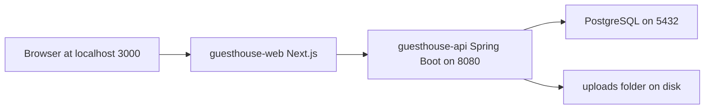
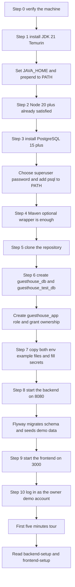

# Local Setup — Guest House Manager

This is the master, end-to-end guide for getting **Guest House Manager** running on one Windows 11 machine with nothing but local software: a Java 21 backend (`guesthouse-api`), a Next.js frontend (`guesthouse-web`) and a local PostgreSQL server. Follow it top to bottom exactly once; afterwards you only ever need §17 (the day-to-day command table) and §19 (the other guides). There is no Docker, no cloud database, no deployment step and no internet service to sign up for — every prohibition is listed in [conventions](conventions.md) §13 and the future path is recorded in [future-deployment-roadmap](future-deployment-roadmap.md).

---

## Table of contents

1. [Who this guide is for](#1-who-this-guide-is-for)
2. [Verify your machine first](#2-verify-your-machine-first)
3. [The setup path at a glance](#3-the-setup-path-at-a-glance)
4. [Prerequisites](#4-prerequisites)
5. [Step 1 — Install JDK 21](#5-step-1--install-jdk-21)
6. [Step 2 — Node.js 20 or newer](#6-step-2--nodejs-20-or-newer)
7. [Step 3 — Install PostgreSQL 15 or newer](#7-step-3--install-postgresql-15-or-newer)
8. [Step 4 — Maven (optional)](#8-step-4--maven-optional)
9. [Step 5 — Get the project onto the machine](#9-step-5--get-the-project-onto-the-machine)
10. [Step 6 — Create the databases](#10-step-6--create-the-databases)
11. [Step 7 — Create the two environment files](#11-step-7--create-the-two-environment-files)
12. [Step 8 — Start the backend](#12-step-8--start-the-backend)
13. [Step 9 — Start the frontend](#13-step-9--start-the-frontend)
14. [Step 10 — Log in with a demo account](#14-step-10--log-in-with-a-demo-account)
15. [Your first five minutes](#15-your-first-five-minutes)
16. [Local URLs](#16-local-urls)
17. [Day-to-day command reference](#17-day-to-day-command-reference)
18. [Setup checklist](#18-setup-checklist)
19. [What to do next](#19-what-to-do-next)
20. [If a step fails](#20-if-a-step-fails)

---

## 1. Who this guide is for

You are the guest house owner or the person who will run the system on the office computer. You are comfortable opening a terminal and pasting commands, but you are **not** a developer and you should never have to read Java or TypeScript to get the system running.

Three separate programs make up the system, and all three run on your own machine:



If any one of the three is not running, the system will not work. §16 tells you how to check each one.

> **Windows first.** Every command block is written for **Windows PowerShell**, which is what you get when you open *Terminal* or *PowerShell* from the Start menu. A macOS/Linux equivalent follows immediately after where the command differs. Run **one block at a time** and read the output before moving on.

---

## 2. Verify your machine first

Before installing anything, take an inventory. Run each command and compare with the "Expected / verified on this machine" column in §4. Nothing here changes your computer.

**Check the PowerShell version** (5.1 or PowerShell 7 are both fine):

```powershell
$PSVersionTable.PSVersion.ToString()
```

**Check Node.js:**

```powershell
node --version
```

**Check npm:**

```powershell
npm --version
```

**Check Git:**

```powershell
git --version
```

**Check Java** — this is the one that will fail on a fresh machine:

```powershell
java -version
```

**Check which `java.exe` actually wins on your PATH:**

```powershell
(Get-Command java -ErrorAction SilentlyContinue).Source
```

**Check Maven:**

```powershell
mvn -version
```

**Check the PostgreSQL client:**

```powershell
psql --version
```

**Check whether anything is already listening on the PostgreSQL port:**

```powershell
Test-NetConnection -ComputerName localhost -Port 5432 -InformationLevel Quiet -WarningAction SilentlyContinue
```

**Check whether the app ports are free** (both should print `False` before you start anything):

```powershell
8080, 3000 | ForEach-Object { "$_ = " + (Test-NetConnection -ComputerName localhost -Port $_ -InformationLevel Quiet -WarningAction SilentlyContinue) }
```

### What the target machine actually reported

These are the verified results from the office machine this guide was written against, on 2026-07-27:

| Check | Result | Verdict |
|---|---|---|
| `$PSVersionTable.PSVersion` | `5.1.26100.8894` | OK |
| `node --version` | `v24.12.0` | OK — well above the Node 20 minimum |
| `npm --version` | `11.12.1` | OK |
| `git --version` | `2.53.0.windows.2` | OK |
| `java -version` | `1.8.0_421`, **32-bit Client VM**, JRE only | **Must fix — install JDK 21 (§5)** |
| `(Get-Command java).Source` | `C:\Program Files (x86)\Common Files\Oracle\Java\java8path\java.exe` | Explains the above — see the PATH warning in §5.4 |
| `mvn -version` | not found | Fine — the repo ships a Maven Wrapper (§8) |
| `psql --version` | not found | **Must fix — install PostgreSQL (§7)** |
| Port 5432 | `False` (closed) | Confirms no PostgreSQL server is installed yet |
| `winget --version` | `v1.29.280` | OK — you can use the one-line installs |

So on this machine exactly **two things are missing: a JDK 21 and PostgreSQL.** Everything else is already in place.

### macOS / Linux equivalents

```bash
node --version && npm --version && git --version && java -version && mvn -version && psql --version
```

```bash
nc -z localhost 5432 && echo "5432 open" || echo "5432 closed"
```

---

## 3. The setup path at a glance



Budget about 45 minutes the first time, most of which is the PostgreSQL installer.

---

## 4. Prerequisites

| Software | Minimum version | Why it is needed | How to check | Verified on this machine |
|---|---|---|---|---|
| Windows | Windows 11 (build 22000+) | Host OS | `winver` | Windows 11 Pro 10.0.26200 |
| Windows PowerShell | 5.1 | Runs every command in this guide | `$PSVersionTable.PSVersion.ToString()` | 5.1.26100.8894 |
| winget | 1.6+ | One-line installs of the JDK and PostgreSQL | `winget --version` | v1.29.280 |
| **JDK (not JRE)** | **21 LTS** | Compiles and runs `guesthouse-api`. Java 21 is pinned in [conventions](conventions.md) §2 | `java -version` and `javac -version` | **Missing — only JRE 1.8 x86** |
| Node.js | 20.x LTS or newer | Runs `guesthouse-web`; Next.js 15 requires 18.18+ | `node --version` | v24.12.0 ✔ |
| npm | 10+ | Installs frontend packages | `npm --version` | 11.12.1 ✔ |
| **PostgreSQL server** | **15** | The only database. `gen_random_uuid()`, `btree_gist` exclusion constraints and trusted extensions all need a modern server | `psql --version` + port 5432 | **Missing** |
| `psql` client | ships with the server | Creating databases, backups, inspection | `psql --version` | Missing |
| Git | 2.30+ | Clone the repository | `git --version` | 2.53.0 ✔ |
| Maven | 3.9+ | **Optional.** The repo commits a Maven Wrapper (`mvnw.cmd`) | `mvn -version` | Not installed — fine |
| A modern browser | Chrome/Edge 120+ | The app, plus PWA and service-worker testing | browser About page | Assumed present |
| Disk space | ~4 GB free | JDK ~330 MB, PostgreSQL ~1.3 GB, `node_modules` ~800 MB, `~/.m2` ~600 MB | `Get-PSDrive D` | — |
| RAM | 8 GB (16 GB comfortable) | Backend + frontend dev server + PostgreSQL at once | Task Manager | — |

Deliberately **not** prerequisites, and never will be in this phase: Docker, Docker Compose, an IDE licence, an SMTP account, an SMS gateway, a cloud project. See [conventions](conventions.md) §13.

---

## 5. Step 1 — Install JDK 21

You currently have a **32-bit Java 8 runtime**, which cannot compile or run this project. You need a 64-bit **JDK 21**. We use **Eclipse Temurin**, the free OpenJDK build from the Eclipse Adoptium project.

You do not have to uninstall Java 8. It can sit alongside JDK 21 — §5.4 makes sure JDK 21 is the one that wins.

### 5.1 Option A — winget (recommended, one line)

```powershell
winget install --exact --id EclipseAdoptium.Temurin.21.JDK --accept-package-agreements --accept-source-agreements
```

That installs the 64-bit JDK to `C:\Program Files\Eclipse Adoptium\jdk-21.x.y-hotspot`. **Close the terminal window and open a new one** afterwards — a running terminal never sees new environment variables.

### 5.2 Option B — manual installer

1. Open <https://adoptium.net/temurin/releases/> in your browser.
2. Choose **Version: 21 - LTS**, **Operating System: Windows**, **Architecture: x64**, **Package Type: JDK**.
3. Download the `.msi` file (its name looks like `OpenJDK21U-jdk_x64_windows_hotspot_21.0.11_10.msi`).
4. Run it. On the **Custom Setup** screen, expand the feature list and switch **"Set JAVA_HOME variable"** and **"Add to PATH"** to *Will be installed on local hard drive*. That saves you §5.3 and part of §5.4.
5. Finish the installer, then close and reopen your terminal.

### 5.3 Find the install directory and set `JAVA_HOME`

List what got installed:

```powershell
Get-ChildItem "C:\Program Files\Eclipse Adoptium" | Select-Object Name
```

You will see one folder, for example `jdk-21.0.11.10-hotspot`. Now open an **elevated** PowerShell — press <kbd>Win</kbd>, type *PowerShell*, then choose **Run as administrator** — or run:

```powershell
Start-Process powershell -Verb RunAs
```

In the **elevated** window, set `JAVA_HOME` machine-wide (substitute the exact folder name you just saw):

```powershell
[Environment]::SetEnvironmentVariable("JAVA_HOME", "C:\Program Files\Eclipse Adoptium\jdk-21.0.11.10-hotspot", "Machine")
```

### 5.4 Put JDK 21 **in front of** Java 8 on the PATH

> **This is the step people get wrong on this machine.** Windows builds the effective `PATH` as *machine PATH first, then user PATH*. Your machine PATH already contains
> `C:\Program Files (x86)\Common Files\Oracle\Java\java8path`, which is why `java -version` reports 1.8. Appending JDK 21 to your **user** PATH would therefore change nothing. The new entry must go at the **front of the machine PATH**.

Still in the **elevated** window, look at the Java entries currently on the machine PATH:

```powershell
[Environment]::GetEnvironmentVariable('Path','Machine') -split ';' | Where-Object { $_ -match 'java|jdk|jre|Adoptium|Oracle' }
```

Now prepend `%JAVA_HOME%\bin` — resolved to a literal path, and de-duplicated so it is safe to run twice:

```powershell
$jb = "$([Environment]::GetEnvironmentVariable('JAVA_HOME','Machine'))\bin"; $p = @([Environment]::GetEnvironmentVariable('Path','Machine') -split ';' | Where-Object { $_ -and $_ -ne $jb }); [Environment]::SetEnvironmentVariable('Path', ((@($jb) + $p) -join ';'), 'Machine')
```

Two notes on why it is written that way:

- The literal expanded path is stored, not the string `%JAVA_HOME%\bin`. `[Environment]::SetEnvironmentVariable` writes a plain `REG_SZ` value, and Windows does **not** expand `%VAR%` inside a `REG_SZ` PATH. If you ever change `JAVA_HOME` to a different JDK, re-run this command.
- If you prefer clicking, the same thing lives in *Settings → System → About → Advanced system settings → Environment Variables → System variables → Path → Edit → New → Move Up*.

**Close every open terminal**, then open a fresh one.

### 5.5 macOS / Linux equivalents

macOS with Homebrew:

```bash
brew install --cask temurin@21
```

```bash
echo 'export JAVA_HOME=$(/usr/libexec/java_home -v 21)' >> ~/.zshrc
```

Ubuntu/Debian:

```bash
sudo apt-get install -y temurin-21-jdk
```

```bash
echo 'export JAVA_HOME=/usr/lib/jvm/temurin-21-jdk-amd64' >> ~/.bashrc
```

```bash
echo 'export PATH="$JAVA_HOME/bin:$PATH"' >> ~/.bashrc
```

(If `temurin-21-jdk` is not in your apt sources, `sudo apt-get install -y openjdk-21-jdk` is an equally valid OpenJDK build.)

### 5.6 Verify

```powershell
java -version
```

Expected: `openjdk version "21.0.x"` and **64-Bit Server VM**. If it still says `1.8.0_421`, your terminal is stale or §5.4 did not run elevated.

```powershell
javac -version
```

Expected: `javac 21.0.x`. If `javac` is missing you installed a JRE, not a JDK — go back to §5.1.

```powershell
$env:JAVA_HOME
```

Expected: the Adoptium path with no trailing backslash and no quotes.

---

## 6. Step 2 — Node.js 20 or newer

**Already satisfied on this machine** (`v24.12.0` / npm `11.12.1`). Skip to §7.

Only if you are setting up a different machine:

```powershell
winget install --exact --id OpenJS.NodeJS.LTS --accept-package-agreements --accept-source-agreements
```

macOS:

```bash
brew install node@22
```

Linux (nvm, avoids `sudo npm`):

```bash
curl -o- https://raw.githubusercontent.com/nvm-sh/nvm/v0.40.1/install.sh | bash && nvm install 22
```

Verify:

```powershell
node --version
```

Anything `v20.x` or newer is fine. Do **not** downgrade the working `v24.12.0` you already have; Next.js 15 and Vitest both run on it.

---

## 7. Step 3 — Install PostgreSQL 15 or newer

PostgreSQL is the system's only data store. It is installed as a normal Windows service that starts with the computer.

This section gets you a working server. Everything *about* the database — roles, extensions, encoding, backups, resets — lives in [local-database-setup](local-database-setup.md), which you should read straight after this guide.

### 7.1 Option A — winget

```powershell
winget install --exact --id PostgreSQL.PostgreSQL.17 --accept-package-agreements --accept-source-agreements
```

Version 17 is the current stable line and comfortably above our minimum of 15. `PostgreSQL.PostgreSQL.16` and `PostgreSQL.PostgreSQL.15` are equally acceptable package ids; do **not** install 13 or older.

The winget install is silent and sets the `postgres` superuser password to the package default. Because you cannot see or choose it, immediately change it — §7.4 shows how. If you would rather choose the password up front, use Option B.

### 7.2 Option B — the interactive installer (choose your own password)

1. Open <https://www.postgresql.org/download/windows/> and follow through to the EDB installer for **PostgreSQL 17, Windows x86-64**.
2. Run the installer and accept the default install directory `C:\Program Files\PostgreSQL\17`.
3. **Select Components** — keep *PostgreSQL Server*, *pgAdmin 4* and *Command Line Tools*. Command Line Tools is what gives you `psql`; do not deselect it. *Stack Builder* is not needed.
4. **Data Directory** — accept `C:\Program Files\PostgreSQL\17\data`.
5. **Password** — this is the password for the `postgres` **superuser**. Choose something you will not lose; you will paste it into `DB_PASSWORD` later. It is a local-only password, so a memorable passphrase such as `sotsamban-local-2026` is fine. **Write it down now.** There is no recovery flow.
6. **Port** — leave `5432`. Your check in §2 showed the port is closed, so nothing will conflict.
7. **Locale** — leave *[Default locale]*. §10 creates the databases with an explicit UTF8 encoding, so the cluster locale does not matter.
8. Finish. Uncheck *Launch Stack Builder*.

### 7.3 Add `psql` to the PATH and verify the service

The installer does **not** add the PostgreSQL `bin` folder to your PATH. In an **elevated** PowerShell:

```powershell
$pgBin = (Get-ChildItem "C:\Program Files\PostgreSQL" -Directory | Sort-Object Name -Descending | Select-Object -First 1).FullName + "\bin"; $p = @([Environment]::GetEnvironmentVariable('Path','Machine') -split ';' | Where-Object { $_ -and $_ -ne $pgBin }); [Environment]::SetEnvironmentVariable('Path', (($p + $pgBin) -join ';'), 'Machine')
```

Close and reopen the terminal, then:

```powershell
psql --version
```

Expected: `psql (PostgreSQL) 17.x`.

Check that the service is running:

```powershell
Get-Service -Name "postgresql*" | Select-Object Name, Status, StartType
```

Expected: one service, `Status = Running`, `StartType = Automatic`.

Check the port is now open:

```powershell
Test-NetConnection -ComputerName localhost -Port 5432 -InformationLevel Quiet -WarningAction SilentlyContinue
```

Expected: `True` (it was `False` in §2).

### 7.4 Set or reset the `postgres` superuser password

Skip this if you chose the password yourself in §7.2. If you used winget, do it now.

Connect as the superuser (Windows authentication is not used; you will be prompted for the current password — with a winget install, try leaving it empty and pressing Enter, otherwise the package default is `postgres`):

```powershell
psql --host=localhost --port=5432 --username=postgres --dbname=postgres
```

At the `postgres=#` prompt:

```sql
\password postgres
```

Type the new password twice (it is not echoed), then leave:

```sql
\q
```

`\password` is safer than `ALTER USER ... PASSWORD '...'` because the plaintext never lands in your shell history or the PostgreSQL log.

### 7.5 macOS / Linux equivalents

macOS:

```bash
brew install postgresql@17
```

```bash
brew services start postgresql@17
```

Ubuntu/Debian:

```bash
sudo apt-get install -y postgresql-17 postgresql-client-17
```

```bash
sudo systemctl enable --now postgresql
```

Set the superuser password on Linux:

```bash
sudo -u postgres psql -c "\password postgres"
```

### 7.6 Optional — pgAdmin 4

A point-and-click database browser. Useful if reading `psql` output makes you nervous; nothing in this project requires it.

```powershell
winget install --exact --id PostgreSQL.pgAdmin --accept-package-agreements --accept-source-agreements
```

---

## 8. Step 4 — Maven (optional)

**You can skip this entirely.** The repository commits a **Maven Wrapper** (`mvnw`, `mvnw.cmd`, `.mvn/wrapper/`), pinned in [conventions](conventions.md) §2. The wrapper downloads the exact Maven version the project expects on first use and then runs it. Every backend command in this documentation uses `.\mvnw.cmd` (Windows) or `./mvnw` (macOS/Linux) for that reason.

Install a global Maven only if you like typing `mvn`. Apache Maven is **not** in the winget default source, so use one of these:

Scoop:

```powershell
scoop install maven
```

Chocolatey (elevated):

```powershell
choco install maven -y
```

Manual: download the binary zip from <https://maven.apache.org/download.cgi>, extract to `C:\Tools\apache-maven-3.9.9`, then in an **elevated** PowerShell:

```powershell
$mvnBin = "C:\Tools\apache-maven-3.9.9\bin"; $p = @([Environment]::GetEnvironmentVariable('Path','Machine') -split ';' | Where-Object { $_ -and $_ -ne $mvnBin }); [Environment]::SetEnvironmentVariable('Path', (($p + $mvnBin) -join ';'), 'Machine')
```

macOS / Linux:

```bash
brew install maven
```

```bash
sudo apt-get install -y maven
```

Verify (in a new terminal):

```powershell
mvn -version
```

The reported "Java version" line must say 21. If it says 1.8, `JAVA_HOME` is wrong — return to §5.3.

---

## 9. Step 5 — Get the project onto the machine

The repository root is `guest-house-management/`, mapped on this machine to `D:\Project\SotSambanGuestHouse` ([conventions](conventions.md) §1). If the folder already contains the project, skip to §10.

```powershell
git clone <your-repository-url> D:\Project\SotSambanGuestHouse
```

```powershell
cd D:\Project\SotSambanGuestHouse
```

Confirm you are in the right place — you should see four entries:

```powershell
Get-ChildItem | Select-Object Name
```

Expected layout ([conventions](conventions.md) §12):

| Entry | Contents |
|---|---|
| `guesthouse-api/` | Spring Boot 3 + Java 21 backend, Maven Wrapper committed |
| `guesthouse-web/` | Next.js 15 + TypeScript frontend |
| `database/` | Standalone SQL helpers: create databases, create the app role, reset local data |
| `docs/` | This documentation set |
| `README.md` | One-page orientation |

macOS / Linux:

```bash
git clone <your-repository-url> ~/Project/SotSambanGuestHouse
```

```bash
cd ~/Project/SotSambanGuestHouse
```

> **Keep the path free of spaces and non-ASCII characters.** `D:\Project\SotSambanGuestHouse` is good. A path like `D:\My Documents\ផ្ទះសំណាក់` will break some Maven plugin and Node tooling paths on Windows.

---

## 10. Step 6 — Create the databases

Two databases are needed, both named in [conventions](conventions.md) §1: `guesthouse_db` for daily use and `guesthouse_test_db` for the automated tests. You do **not** create any tables by hand — Flyway does that when the backend first starts (§12).

Run the committed helper script as the superuser:

```powershell
psql --host=localhost --port=5432 --username=postgres --dbname=postgres --file=D:\Project\SotSambanGuestHouse\database\01_create_databases.sql
```

If you prefer to see exactly what happens, this is the equivalent typed by hand. Open a session:

```powershell
psql --host=localhost --port=5432 --username=postgres --dbname=postgres
```

Create the development database with an explicit UTF8 encoding:

```sql
CREATE DATABASE guesthouse_db WITH ENCODING 'UTF8' LC_COLLATE 'C' LC_CTYPE 'C' TEMPLATE template0;
```

Create the test database:

```sql
CREATE DATABASE guesthouse_test_db WITH ENCODING 'UTF8' LC_COLLATE 'C' LC_CTYPE 'C' TEMPLATE template0;
```

Pin both to UTC, as required by [conventions](conventions.md) §5:

```sql
ALTER DATABASE guesthouse_db SET timezone TO 'UTC';
```

```sql
ALTER DATABASE guesthouse_test_db SET timezone TO 'UTC';
```

Create the dedicated application role — this is the **recommended** setup and the reasons are argued in [local-database-setup](local-database-setup.md) §5. Replace the password with one you choose:

```sql
CREATE ROLE guesthouse_app WITH LOGIN PASSWORD 'change_this_local_password';
```

Make it the owner of both databases, so Flyway can create the schema and the four required extensions without superuser rights:

```sql
ALTER DATABASE guesthouse_db OWNER TO guesthouse_app;
```

```sql
ALTER DATABASE guesthouse_test_db OWNER TO guesthouse_app;
```

Confirm and leave:

```sql
\l guesthouse*
```

```sql
\q
```

The listing must show `guesthouse_db` and `guesthouse_test_db`, `Owner = guesthouse_app`, `Encoding = UTF8`.

macOS / Linux — same SQL, reached with:

```bash
sudo -u postgres psql -f database/01_create_databases.sql
```

> **No cloud, no container.** This is a plain local PostgreSQL service. There is no managed database, no Docker image and no connection string pointing anywhere but `localhost`.

---

## 11. Step 7 — Create the two environment files

Two files hold your local settings. Both are git-ignored and **must never be committed**; only the `*.example` templates are tracked ([conventions](conventions.md) §14).

### 11.1 Backend — `guesthouse-api/.env`

```powershell
Copy-Item D:\Project\SotSambanGuestHouse\guesthouse-api\.env.example D:\Project\SotSambanGuestHouse\guesthouse-api\.env
```

Open it:

```powershell
notepad D:\Project\SotSambanGuestHouse\guesthouse-api\.env
```

Edit it to look like this, changing only the two marked lines:

```env
SPRING_PROFILES_ACTIVE=local
DB_HOST=localhost
DB_PORT=5432
DB_NAME=guesthouse_db
DB_USERNAME=guesthouse_app
DB_PASSWORD=change_this_local_password
JWT_SECRET=replace_with_a_long_local_secret_at_least_64_characters_long_0123456789
JWT_ACCESS_EXPIRATION_MINUTES=30
JWT_REFRESH_EXPIRATION_DAYS=7
FILE_UPLOAD_DIR=uploads
FRONTEND_URL=http://localhost:3000
SEED_DEMO_DATA=true
```

- `DB_USERNAME` / `DB_PASSWORD` — the `guesthouse_app` role and password from §10. If you skipped the dedicated role, use `postgres` and the superuser password instead.
- `JWT_SECRET` — must be at least 64 characters or the backend refuses to start. Generate one:

```powershell
$pool = (48..57) + (97..122); -join (1..72 | ForEach-Object { [char]($pool | Get-Random) })
```

> `Get-Random -Count N` samples **without replacement**, so drawing more values than the 36-character
> pool (`0-9a-z`) silently caps the result at 36 characters — well under the 64-character minimum. The
> form above samples with replacement so it always returns the requested length.

macOS / Linux:

```bash
openssl rand -hex 36
```

Paste the result after `JWT_SECRET=` with no quotes and no spaces.

`SEED_DEMO_DATA=true` is what creates the demo guest house, 6 room types, 20 rooms, 10 staff users, 50 guests and 30 reservations you will explore in §15.

### 11.2 Frontend — `guesthouse-web/.env.local`

```powershell
Copy-Item D:\Project\SotSambanGuestHouse\guesthouse-web\.env.local.example D:\Project\SotSambanGuestHouse\guesthouse-web\.env.local
```

The defaults are already correct for this machine, so normally you change nothing:

```env
NEXT_PUBLIC_API_URL=http://localhost:8080/api/v1
NEXT_PUBLIC_APP_NAME=Guest House Manager
NEXT_PUBLIC_APP_URL=http://localhost:3000
NEXT_PUBLIC_APP_ENV=local
NEXT_PUBLIC_DEFAULT_LOCALE=en
```

> Anything named `NEXT_PUBLIC_*` is **visible in the browser**. Never put a password, a database name or a JWT secret in this file. Details in [frontend-setup](frontend-setup.md) §4.

Confirm both files exist:

```powershell
Get-ChildItem D:\Project\SotSambanGuestHouse\guesthouse-api\.env, D:\Project\SotSambanGuestHouse\guesthouse-web\.env.local | Select-Object FullName, Length
```

---

## 12. Step 8 — Start the backend

The first run downloads Maven and all Java dependencies. Expect 3–8 minutes and a lot of scrolling. Later runs take about 20 seconds.

```powershell
cd D:\Project\SotSambanGuestHouse\guesthouse-api
```

```powershell
.\mvnw.cmd spring-boot:run
```

macOS / Linux:

```bash
./mvnw spring-boot:run
```

**What you should see, in order:**

1. Maven resolving dependencies.
2. The Spring Boot banner and `The following 1 profile is active: "local"`.
3. `HikariPool-1 - Start completed.` — the database connection works.
4. Flyway output: `Successfully validated N migrations`, then `Migrating schema "public" to version 001 - create extensions`, one line per migration, ending in `Successfully applied N migrations`.
5. `Seeding demo data ...` followed by counts, because `SEED_DEMO_DATA=true`. This happens once; on later starts it detects existing data and skips.
6. `Tomcat started on port 8080 (http)` and `Started GuesthouseApiApplication in X.XXX seconds`.

**Leave this window open.** Closing it stops the backend. Stop it deliberately with <kbd>Ctrl</kbd>+<kbd>C</kbd>.

Open a **second** terminal window and confirm the backend answers:

```powershell
Invoke-RestMethod http://localhost:8080/api/v1/health
```

macOS / Linux:

```bash
curl -s http://localhost:8080/api/v1/health
```

You should get the standard success envelope from [conventions](conventions.md) §9.1 — `success: true` plus a `data` object reporting the database as reachable.

If it failed, jump to §20, or to [backend-setup](backend-setup.md) §17 for the full error catalogue.

---

## 13. Step 9 — Start the frontend

In the **second** terminal (leave the backend running in the first):

```powershell
cd D:\Project\SotSambanGuestHouse\guesthouse-web
```

Install the packages — first time only, about 2–4 minutes:

```powershell
npm ci
```

Use `npm ci` rather than `npm install`: it installs the exact versions in `package-lock.json`, so your machine gets the same tree as everyone else's. Use `npm install` only when you are deliberately adding a package.

Start the dev server:

```powershell
npm run dev
```

Expected output ends with `Local: http://localhost:3000` and `Ready in ...`.

Open the app:

```powershell
Start-Process http://localhost:3000
```

macOS:

```bash
open http://localhost:3000
```

Linux:

```bash
xdg-open http://localhost:3000
```

You should land on the login page, in English, with the Guest House Manager name from `NEXT_PUBLIC_APP_NAME`.

---

## 14. Step 10 — Log in with a demo account

Seven demo accounts are created by the seed data, one per role in [conventions](conventions.md) §7.1. Start with the owner.

> **(new, derived)** The exact demo e-mail addresses and password below are not fixed by [conventions](conventions.md); they are defined here and must match `V0xx__seed_demo_data.sql`. They exist **only** under the `local` profile and only when `SEED_DEMO_DATA=true`. They are local-development credentials, deliberately weak and deliberately documented — exactly as required by the brief. No profile other than `local` may ever seed them.

| Role | E-mail | Password | What it is for |
|---|---|---|---|
| `OWNER` | `owner@guesthouse.local` | `Demo@1234` | Everything. Use this first. |
| `MANAGER` | `manager@guesthouse.local` | `Demo@1234` | Daily operations without settings/security |
| `RECEPTIONIST` | `reception@guesthouse.local` | `Demo@1234` | Reservations, check-in, check-out, payments |
| `ACCOUNTANT` | `accountant@guesthouse.local` | `Demo@1234` | Payments, invoices, expenses, financial reports |
| `HOUSEKEEPING` | `housekeeping@guesthouse.local` | `Demo@1234` | Own cleaning tasks and room statuses only |
| `MAINTENANCE` | `maintenance@guesthouse.local` | `Demo@1234` | Own maintenance issues only |
| `READONLY` | `readonly@guesthouse.local` | `Demo@1234` | Look, never touch |

1. Type `owner@guesthouse.local` and `Demo@1234`.
2. Leave **Remember me** unchecked for now — it lengthens the refresh-token lifetime and you want to see the normal session behaviour first.
3. Press **Sign in**. You land on `/dashboard`.

Logging in as the different roles is the fastest way to see the permission matrix working: the sidebar shrinks, and buttons the role cannot use disappear. The authoritative mapping is [permission-matrix](permission-matrix.md); the frontend check is convenience only, and the backend enforces every permission itself ([conventions](conventions.md) §8).

Change the owner password once you start entering real data: **profile menu → Profile → Change password**.

Forgot the password already? There is no e-mail server locally. Use **Forgot password**, then look in the **backend terminal window** — the reset link is printed to the console there, and also listed under *Settings → Local Development → Local test e-mail viewer*. See [backend-setup](backend-setup.md) §15.

---

## 15. Your first five minutes

Do these in order as the `OWNER` account. Each one proves a slice of the system works end to end.

**Minute 1 — read the dashboard.** `/dashboard` shows the summary cards: total, available, occupied, reserved, dirty and out-of-service rooms, occupancy rate, today's arrivals and departures, in-house guests, outstanding payments, today's and this month's revenue and expenses. With seed data these are all non-zero. Change the date filter and watch them recompute — every number is calculated on the backend.

**Minute 2 — look at the room status board.** Go to **Rooms → Board** (`/rooms/board`). Twenty rooms as colour-coded tiles. Each tile's label is *derived* from two independent values, the operational status and the housekeeping status ([conventions](conventions.md) §7.2) — that is why a room can be "Occupied" and "Dirty" at the same time.

**Minute 3 — open the calendar.** **Calendar** (`/calendar`) in *Room timeline* view: rooms down the side, dates across the top, reservation bars in status colours. Click a bar to open the reservation. Press **Today** to jump back.

**Minute 4 — create a reservation.** **Reservations → New**. Pick tomorrow as arrival and three nights, 2 adults, choose a room type, pick an available room, choose an existing seeded guest, save. The reservation gets a number like `RSV-2026-000031` ([conventions](conventions.md) §10). Now try to create a second reservation on the *same room* for overlapping dates: it is refused with the error `ROOM_NOT_AVAILABLE`. That refusal comes from a database exclusion constraint plus a backend check, not from the browser.

**Minute 5 — check someone in and take a payment.** **Check-In**, find an arrival for today from the seed data, walk the steps, record a cash deposit, complete. The room flips to Occupied, the folio shows a balance, and the guest appears under **In-House Guests**. Open **Reports → Daily revenue** and see your deposit in today's figures.

When you are done experimenting, put the demo data back to its original state: **Settings → Local Development → Reset seed data** (only visible in the `local` profile, only for a user holding `dev:reset_data`). The command-line equivalents are in [local-database-setup](local-database-setup.md) §14.

---

## 16. Local URLs

Everything is `localhost`. Nothing here is reachable from another computer, and no HTTPS certificate exists — that is deliberate ([conventions](conventions.md) §13).

| What | URL | Served by | Notes |
|---|---|---|---|
| The application | <http://localhost:3000> | `guesthouse-web` | Start here |
| Login | <http://localhost:3000/login> | `guesthouse-web` | |
| Dashboard | <http://localhost:3000/dashboard> | `guesthouse-web` | After login |
| Owner onboarding | <http://localhost:3000/onboarding> | `guesthouse-web` | The 14 setup steps |
| Room status board | <http://localhost:3000/rooms/board> | `guesthouse-web` | |
| Calendar | <http://localhost:3000/calendar> | `guesthouse-web` | |
| Reports | <http://localhost:3000/reports> | `guesthouse-web` | |
| Settings | <http://localhost:3000/settings> | `guesthouse-web` | |
| Local Development tools | <http://localhost:3000/dev> | `guesthouse-web` | Rendered only when `NEXT_PUBLIC_APP_ENV=local` |
| Offline fallback page | <http://localhost:3000/offline> | service worker | See [pwa-guide](pwa-guide.md) |
| Web manifest | <http://localhost:3000/manifest.webmanifest> | `guesthouse-web` | |
| Service worker | <http://localhost:3000/sw.js> | `guesthouse-web` | |
| API base | <http://localhost:8080/api/v1> | `guesthouse-api` | Every endpoint hangs off this |
| API health | <http://localhost:8080/api/v1/health> | `guesthouse-api` | Quickest "is the backend up" check |
| Swagger UI | <http://localhost:8080/swagger-ui.html> | `guesthouse-api` | Try any endpoint by hand |
| OpenAPI JSON | <http://localhost:8080/v3/api-docs> | `guesthouse-api` | Machine-readable contract |
| Local dev API group | <http://localhost:8080/api/v1/dev> | `guesthouse-api` | Exists **only** under the `local` profile |
| PostgreSQL | `localhost:5432` | PostgreSQL service | Not a web address; use `psql` or pgAdmin |

---

## 17. Day-to-day command reference

Run backend commands from `D:\Project\SotSambanGuestHouse\guesthouse-api` and frontend commands from `D:\Project\SotSambanGuestHouse\guesthouse-web`. On macOS/Linux replace `.\mvnw.cmd` with `./mvnw`.

| Goal | Command | Notes |
|---|---|---|
| **Backend** | | |
| Start the backend | `.\mvnw.cmd spring-boot:run` | Default profile `local`. Ctrl+C to stop |
| Start with SQL logging | `.\mvnw.cmd spring-boot:run "-Dspring-boot.run.jvmArguments=-Dspring.jpa.show-sql=true"` | Prints every statement |
| Compile only | `.\mvnw.cmd clean compile` | Fastest "does it build" check |
| Run all backend tests | `.\mvnw.cmd test` | Uses the `test` profile and `guesthouse_test_db` |
| Run one test class | `.\mvnw.cmd test "-Dtest=ReservationServiceTest"` | |
| Build the jar | `.\mvnw.cmd clean package` | Output in `target/` |
| Build, skipping tests | `.\mvnw.cmd clean package -DskipTests` | Only when you already ran the tests |
| Run the built jar | `java -jar target\guesthouse-api-0.0.1-SNAPSHOT.jar` | Reads the same `.env` |
| Show the dependency tree | `.\mvnw.cmd dependency:tree` | Diagnosing version clashes |
| Show effective configuration | `.\mvnw.cmd help:effective-pom` | |
| Migration status | `.\mvnw.cmd flyway:info` | Optional plugin — see [backend-setup](backend-setup.md) §12 |
| Refresh dependencies offline-safe | `.\mvnw.cmd -U clean compile` | Forces a re-check of snapshots |
| **Frontend** | | |
| Install exact dependencies | `npm ci` | After a clone or a lockfile change |
| Add a dependency | `npm install <package>` | Commit the updated lockfile |
| Start the dev server | `npm run dev` | <http://localhost:3000>, hot reload |
| Production-style build | `npm run build` | Catches type and prerender errors `dev` hides |
| Serve the built app | `npm run start` | Required for realistic PWA testing |
| Lint | `npm run lint` | ESLint; `any` is an error |
| Type-check only | `npm run typecheck` | `tsc --noEmit`, no build output |
| Unit/component tests | `npm run test` | Vitest, single run |
| Unit tests, watch mode | `npm run test:watch` | While writing a component |
| End-to-end tests | `npm run e2e` | Playwright, headless |
| End-to-end tests, UI runner | `npm run e2e:ui` | Step through a scenario visually |
| Add a shadcn/ui component | `npx shadcn@latest add dialog` | Lands in `components/ui/` |
| **Database** | | |
| Open a session | `psql --host=localhost --port=5432 --username=guesthouse_app --dbname=guesthouse_db` | |
| List tables | `\dt` | Inside `psql` |
| Back up | `pg_dump --format=custom --file=backup.dump --username=guesthouse_app --dbname=guesthouse_db` | See [local-database-setup](local-database-setup.md) §13 |
| Check the service | `Get-Service -Name "postgresql*"` | Windows |
| **Both at once** | | |
| Free a stuck port 8080 | `Get-NetTCPConnection -LocalPort 8080 -State Listen \| Select-Object OwningProcess` | Then `Stop-Process -Id <pid>` |
| Free a stuck port 3000 | `Get-NetTCPConnection -LocalPort 3000 -State Listen \| Select-Object OwningProcess` | Then `Stop-Process -Id <pid>` |

---

## 18. Setup checklist

Tick these off. If every line is ticked, criteria 1–6 of the brief's 35 success criteria are met.

- [ ] `$PSVersionTable.PSVersion` prints 5.1 or higher
- [ ] `java -version` prints `21.x` and **64-Bit Server VM** (not `1.8.0_421`)
- [ ] `javac -version` prints `21.x`
- [ ] `$env:JAVA_HOME` points at the Temurin 21 folder
- [ ] `node --version` prints `v20` or newer
- [ ] `npm --version` prints `10` or newer
- [ ] `git --version` prints something
- [ ] `psql --version` prints `15` or newer
- [ ] `Get-Service postgresql*` shows **Running**
- [ ] Port 5432 answers `True`
- [ ] `guesthouse_db` exists, owner `guesthouse_app`, encoding `UTF8`
- [ ] `guesthouse_test_db` exists with the same settings
- [ ] Both databases report `timezone = UTC`
- [ ] `guesthouse-api\.env` exists, is **not** committed, has a 64+ character `JWT_SECRET`
- [ ] `guesthouse-web\.env.local` exists and is **not** committed
- [ ] `.\mvnw.cmd spring-boot:run` reaches `Started GuesthouseApiApplication`
- [ ] Flyway reported `Successfully applied N migrations` with no failures
- [ ] `http://localhost:8080/api/v1/health` returns `success: true`
- [ ] `http://localhost:8080/swagger-ui.html` opens and lists the endpoint groups
- [ ] `npm ci` finished with no `ERR!` lines
- [ ] `npm run dev` reports `Ready` on port 3000
- [ ] `http://localhost:3000` shows the login page
- [ ] Logging in as `owner@guesthouse.local` reaches `/dashboard`
- [ ] The dashboard cards show non-zero numbers from the seed data
- [ ] `/rooms/board` shows 20 rooms
- [ ] Creating an overlapping reservation is refused with `ROOM_NOT_AVAILABLE`
- [ ] `npm run typecheck` passes
- [ ] `.\mvnw.cmd test` passes
- [ ] Resetting seed data from *Settings → Local Development* works

---

## 19. What to do next

| Read this | When |
|---|---|
| [local-database-setup](local-database-setup.md) | Right after this guide. Roles, extensions, encoding, backups, resets, connection troubleshooting |
| [backend-setup](backend-setup.md) | Before touching anything under `guesthouse-api` — profiles, configuration properties, Flyway rules, Swagger, the feature recipe |
| [frontend-setup](frontend-setup.md) | Before touching anything under `guesthouse-web` — npm scripts, the API client, feature folders, shadcn/ui, i18n, theming |
| [testing-guide](testing-guide.md) | Before your first commit — unit, repository, service, controller, security, migration, component and the 24 Playwright scenarios |
| [pwa-guide](pwa-guide.md) | To install the app as a desktop/mobile icon and test offline behaviour |
| [troubleshooting](troubleshooting.md) | Whenever anything at all misbehaves. Wider than §20 below |
| [conventions](conventions.md) | The binding contract. Names, enums, permission keys, error codes, routes. When in doubt, this wins |
| [product-requirements](product-requirements.md) · [architecture](architecture.md) · [database-design](database-design.md) · [er-diagram](er-diagram.md) · [api-design](api-design.md) · [permission-matrix](permission-matrix.md) | Understanding *why* the system is shaped the way it is |
| [future-deployment-roadmap](future-deployment-roadmap.md) | The day you want this on a real server. Nothing in it is implemented now |

---

## 20. If a step fails

The five failures that account for almost every bad first run. The complete catalogue is in [troubleshooting](troubleshooting.md).

**`java -version` still says 1.8.0_421.**
Your terminal is stale, or §5.4 was not run as administrator. Close *every* terminal, open a new one, and check what wins:

```powershell
(Get-Command java).Source
```

If that still resolves inside `C:\Program Files (x86)\Common Files\Oracle\Java\...`, the Adoptium `bin` folder is not at the front of the **machine** PATH. Re-run §5.4 elevated.

**Backend: `Connection to localhost:5432 refused`.**
PostgreSQL is not running:

```powershell
Get-Service -Name "postgresql*" | Select-Object Name, Status
```

Start it (elevated):

```powershell
Start-Service -Name "postgresql-x64-17"
```

**Backend: `FATAL: password authentication failed for user "guesthouse_app"`.**
`DB_PASSWORD` in `guesthouse-api\.env` does not match the role's password. Prove the credentials outside the app first:

```powershell
psql --host=localhost --port=5432 --username=guesthouse_app --dbname=guesthouse_db
```

If that also fails, reset the role's password as the superuser — [local-database-setup](local-database-setup.md) §15.

**Backend: `Web server failed to start. Port 8080 was already in use.`**
An earlier backend is still alive. Find it:

```powershell
Get-NetTCPConnection -LocalPort 8080 -State Listen | Select-Object OwningProcess
```

Then stop it, substituting the number you saw:

```powershell
Stop-Process -Id <OwningProcess> -Force
```

**Frontend loads but every request fails with a network or CORS error.**
The backend is down, or it is on a different port than `NEXT_PUBLIC_API_URL` expects. Check the backend first:

```powershell
Invoke-RestMethod http://localhost:8080/api/v1/health
```

Then confirm the frontend is pointed at it. Changes to `.env.local` require restarting `npm run dev` — Next.js reads environment variables only at startup. Full explanation in [frontend-setup](frontend-setup.md) §14.
