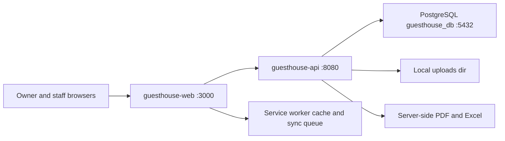
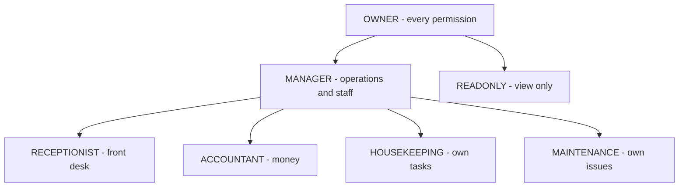

# Product Requirements — Guest House Manager (Phase 1)

This document is the analysed product requirement specification for **Guest House Manager**, a locally-run property management system for a small owner-operated guest house. It converts the owner's raw requirement list in [source-brief](source-brief.md) into decision-bearing requirements: vision, roles, an exhaustive numbered functional-requirement register, the page inventory, the operational workflows, the UX and localisation contracts, non-functional budgets, success criteria and the twelve-phase delivery plan. Every name, enum value, permission key, error code, route and document-number format used here is taken verbatim from [conventions](conventions.md), which is the binding technical contract; where this document needed something conventions.md does not yet define, the addition is derived from the stated rules and marked **(new, derived)**.

## Table of contents

1. [Document status](#1-document-status)
2. [Executive summary and product vision](#2-executive-summary-and-product-vision)
3. [Problem statement and owner capabilities](#3-problem-statement-and-owner-capabilities)
4. [Goals and non-goals](#4-goals-and-non-goals)
5. [Assumptions](#5-assumptions)
6. [Local development scope](#6-local-development-scope)
7. [Out of scope for the local phase](#7-out-of-scope-for-the-local-phase)
8. [User roles and personas](#8-user-roles-and-personas)
9. [Functional requirements](#9-functional-requirements)
10. [Page inventory](#10-page-inventory)
11. [User workflows](#11-user-workflows)
12. [UX requirements](#12-ux-requirements)
13. [Localisation requirements](#13-localisation-requirements)
14. [Non-functional requirements](#14-non-functional-requirements)
15. [Success criteria](#15-success-criteria)
16. [Development phases](#16-development-phases)
17. [Open questions for the owner](#17-open-questions-for-the-owner)
18. [Glossary](#18-glossary)

### Related documents

| Document | Role |
|---|---|
| [conventions](conventions.md) | Binding technical contract — wins over every other document |
| [source-brief](source-brief.md) | Owner's raw requirement enumerations B1–B48 |
| [architecture](architecture.md) | System, module and layering design |
| [database-design](database-design.md) | Tables, columns, constraints, indexes |
| [er-diagram](er-diagram.md) | Entity relationship diagrams |
| [api-design](api-design.md) | Endpoint-by-endpoint request/response contract |
| [permission-matrix](permission-matrix.md) | Authoritative role × permission grid |
| [business-rules](business-rules.md) | The 25 core rules, derived room display status, folio maths |
| [local-setup](local-setup.md) · [local-database-setup](local-database-setup.md) · [backend-setup](backend-setup.md) · [frontend-setup](frontend-setup.md) | Local run instructions |
| [testing-guide](testing-guide.md) · [pwa-guide](pwa-guide.md) · [troubleshooting](troubleshooting.md) | Verification and operations |
| [future-deployment-roadmap](future-deployment-roadmap.md) | Everything deliberately excluded from Phase 1–12 |

---

## 1. Document status

| Item | Value |
|---|---|
| Document | `docs/product-requirements.md` |
| Product | Guest House Manager |
| Phase | **Phase 1 — Planning & Architecture** |
| Date | 2026-07-27 |
| Status | Approved baseline for Phases 2–12 |
| Owner of document | Product Manager / Architect |
| Binding contract | [conventions](conventions.md) — this document conforms to it and never overrides it |
| Requirement source | [source-brief](source-brief.md) sections B1–B48 |
| Change control | Any change to an `FR-xxx` row, an assumption or a success criterion requires a new dated revision line below |

| Revision | Date | Change |
|---|---|---|
| 1.0 | 2026-07-27 | Initial Phase 1 baseline covering B1–B48 |

**Coverage statement.** Every section of the source brief is addressed: B1 in §3, B2 in §8, B3/B4 in §6, B5–B34 in §9, B35–B37 in §14 and [database-design](database-design.md)/[business-rules](business-rules.md), B38 in §12, B39 in §16 and [testing-guide](testing-guide.md), B40–B42 in §6 and §14, B43 in the related-documents table, B44 in §16, B45–B46 in §12, B47 in §15, B48 in §7.

---

## 2. Executive summary and product vision

### 2.1 Vision

**A small guest house owner runs the whole day from one place.** One browser tab, opened on a laptop at the front desk or on a phone while walking the corridors, answers every question the owner has to answer during a working day: which rooms are free tonight, who is arriving, who owes money, which rooms are dirty, what broke, what was spent, and whether this month is better than last month. No spreadsheets, no paper register, no WhatsApp thread as the source of truth, and no monthly fee to a cloud vendor.

### 2.2 What the product is

Guest House Manager is a two-application system that runs entirely on the owner's own computer during Phases 1–12:

- **`guesthouse-api`** — Spring Boot 3.4 on Java 21, exposing `/api/v1` at `http://localhost:8080`, owning every business calculation, every permission check and every database transaction.
- **`guesthouse-web`** — Next.js 15 App Router with React 19 and TypeScript, served at `http://localhost:3000`, a permission-aware, bilingual, mobile-first, installable-ready client that contains no business maths.
- **Local PostgreSQL** `guesthouse_db`, migrated by Flyway, with uploads on the local filesystem under `guesthouse-api/uploads/`.



### 2.3 Why it wins for this owner

| Owner pain | How the product answers it |
|---|---|
| Double bookings from a paper register | Availability computed on the backend and protected by a PostgreSQL exclusion constraint `ex_reservation_rooms__no_overlap` |
| "How much does this guest still owe?" | A single folio per stay with canonical backend maths and a `FolioPaymentStatus` of `UNPAID`, `PARTIALLY_PAID`, `PAID` or `OVERPAID` |
| Cash handled by several people | Every payment carries a `PAY-{YYYY}-{000000}` number, a receiver, a method and an audit entry; voids and refunds need explicit permissions |
| Rooms cleaned or not cleaned, nobody sure | Two orthogonal room dimensions — `operational_status` and `housekeeping_status` — plus a housekeeping task list per day |
| Staff seeing things they should not | 100+ granular `<module>:<action>` permissions enforced with `@PreAuthorize` on the backend |
| Khmer-speaking staff, English-speaking guests | English and Khmer at launch, every string in `messages/en.json` and `messages/km.json` |
| Fear of losing the data to a vendor | The whole system runs on one machine the owner controls; the architecture stays ready for a later server without any rewrite |

### 2.4 Product principles

1. **The backend is the truth.** Totals, availability, statuses and permissions are decided server-side; the client displays them.
2. **One screen per job.** Each front-desk job — check in, take money, change a room, close a stay — is one page with one primary action.
3. **Nothing silently disappears.** Master data is soft-deleted, financial data is voided or reversed, and both leave an audit entry.
4. **Small now, multi-property later.** `property_id` is on every business table from the first migration even though release 1 serves one guest house.
5. **Local first, cloud-ready.** Storage, email, notifications and PDF generation sit behind interfaces so a later cloud swap changes configuration, not business code.
6. **Bilingual by construction.** No user-visible string, status label or permission name is hard-coded in a component.

---

## 3. Problem statement and owner capabilities

### 3.1 Problem statement

A single-property guest house with roughly 20 rooms is currently operated from a paper arrivals book, a phone gallery of guest ID photos, a cash box with hand-written slips and a spreadsheet the owner updates at night. This produces five concrete failures:

1. **Availability is guessed.** Two staff can promise the same room for the same night because nobody can see a reliable room-by-date grid.
2. **Money is untraceable.** Deposits collected by phone, partial payments in cash and refunds at checkout are recorded inconsistently, so the outstanding balance at checkout is negotiated rather than calculated.
3. **Housekeeping and the front desk are not connected.** A departed room is sold again before it has been cleaned or inspected.
4. **There is no record of who did what.** Cancellations, price overrides and voided payments cannot be traced to a person, time or reason.
5. **The owner has no numbers.** Occupancy, ADR, RevPAR, monthly revenue against monthly expenses and repeat-guest rate are unknown, so pricing decisions are guesses.

Guest House Manager replaces all five with one authenticated, audited, permission-scoped system that runs locally.

### 3.2 The 16 owner capabilities (B1) mapped to delivering modules

| # | Owner capability (B1) | Delivering module(s) | Primary route | Phase | FR range |
|---|---|---|---|---|---|
| C-01 | Manage guest house information | Settings → Property, Onboarding | `/settings/property` | 4 | FR-025–FR-053 |
| C-02 | Manage rooms and room types | Rooms, Room Types, Settings → Rooms | `/rooms`, `/room-types` | 5 | FR-054–FR-079 |
| C-03 | Check room availability | Availability engine, Calendar | `/calendar`, availability panel on `/reservations/new` | 5–6 | FR-080–FR-090 |
| C-04 | Create and manage reservations | Reservations, Calendar | `/reservations` | 6 | FR-091–FR-129 |
| C-05 | Register guests | Guests | `/guests` | 6 | FR-130–FR-148 |
| C-06 | Handle check-in and check-out | Check-In, In-House Guests, Check-Out | `/check-in`, `/in-house`, `/check-out` | 7 | FR-149–FR-214 |
| C-07 | Track deposits and payments | Payments, Reservations folio | `/payments` | 8 | FR-248–FR-264 |
| C-08 | Generate invoices and receipts | Documents, Invoices | `/invoices` | 8 | FR-265–FR-276 |
| C-09 | Manage housekeeping | Housekeeping | `/housekeeping` | 9 | FR-277–FR-293 |
| C-10 | Manage maintenance | Maintenance | `/maintenance` | 9 | FR-294–FR-306 |
| C-11 | Track income and expenses | Expenses, Reports | `/expenses`, `/reports` | 10 | FR-307–FR-319, FR-357–FR-389 |
| C-12 | Manage staff and permissions | Staff, Settings → Staff and Security | `/staff`, `/settings/staff-security` | 3–4 | FR-320–FR-332 |
| C-13 | View dashboards and reports | Dashboard, Reports | `/dashboard`, `/reports` | 10 | FR-333–FR-389 |
| C-14 | Receive operational notifications | Notifications | `/notifications` | 9–11 | FR-390–FR-407 |
| C-15 | Use the system on desktop and mobile browsers | Application shell, responsive layer | all routes | 2, 11 | FR-001–FR-008, FR-423–FR-434 |
| C-16 | Prepare the application for future PWA installation | PWA layer | `/offline`, manifest, service worker | 11 | FR-408–FR-422 |

**Cross-cutting capability C-17 — "run and test everything locally"** is not a module; it is the delivery constraint described in §6 and verified by success criteria SC-01–SC-05 and SC-32–SC-35.

---

## 4. Goals and non-goals

### 4.1 Product goals

| ID | Goal | Measured by |
|---|---|---|
| G-01 | A reservation can be taken end-to-end in under 90 seconds by a trained receptionist | Timed run of the create-reservation workflow (§11.2) with a returning guest |
| G-02 | Double booking is structurally impossible | E2E scenario 7 plus a DB-level concurrent-insert test that must fail with `ROOM_NOT_AVAILABLE` |
| G-03 | The folio balance at checkout is always the backend's number | Every checkout screen figure traceable to `FolioCalculator`; no client-computed total accepted |
| G-04 | Every state-changing action names a person, a time and, where blocked, a reason | `audit_logs` row for each `AuditAction` listed in [conventions](conventions.md) §7.8 |
| G-05 | The owner can answer "how was this month?" without leaving the app | Dashboard plus 29 report keys, all exportable to CSV, Excel and PDF |
| G-06 | Khmer-only staff can complete their whole daily job | Every screen passes a Khmer-locale review with zero English leakage |
| G-07 | Front desk keeps working on a phone in a corridor with a weak signal | Read-only offline cache plus queued housekeeping updates; financial operations refuse to queue |
| G-08 | A second property can be added later without a data migration of business tables | `property_id` present and indexed on every business table from the first migration |
| G-09 | The system installs on a clean Windows machine from the docs alone | A fresh run of [local-setup](local-setup.md) reaching SC-06 with no undocumented step |

### 4.2 Non-goals for Phases 1–12

| ID | Non-goal | Why not now |
|---|---|---|
| NG-01 | Being a full hotel ERP | The design target is a 20-room owner-operated house; an ERP-style dense UI is explicitly rejected by B45 |
| NG-02 | Selling rooms to the public | No guest-facing booking surface exists; all reservations are staff-entered (§7) |
| NG-03 | Taking money electronically | Payments are *recorded*, never *processed*; no gateway, no card data stored |
| NG-04 | Distribution to OTAs | Agoda, Booking.com and Airbnb exist only as `ReservationSource` values for manual entry |
| NG-05 | Running on a server for real guests | No deployment, TLS, domain, monitoring or backup service in this phase |
| NG-06 | Paying staff | Payroll is deferred (B27, B48) |
| NG-07 | Multi-currency trading | One currency per property, enforced by rejection of any other currency |
| NG-08 | Hourly or day-use rooms | Nights are whole and half-open; a same-day stay is one night |
| NG-09 | Hardware integration | No keycard encoder, no passport scanner, no cash drawer, no printer driver beyond the browser print dialog |
| NG-10 | Offline write access to money | Financial writes require a confirmed backend connection (B31) |

---

## 5. Assumptions

These are working assumptions for Phase 1–12. Each is falsifiable; §17 lists the ones the owner still has to confirm.

| ID | Assumption | Consequence if it holds |
|---|---|---|
| A-01 | **Release 1 serves exactly one guest house**, but `property_id` is present, `NOT NULL` and indexed on every business table from the first migration, and every service resolves it from the authenticated session rather than from a request parameter. | A second property later needs new rows, not new columns. |
| A-02 | **One currency per property**, defaulting to `USD`, stored as `char(3)` on every monetary row. The API rejects any other currency with `VALIDATION_ERROR`. | No FX table, no conversion maths, no dual-currency folio. |
| A-03 | **Nights are the half-open interval `[arrival_date, departure_date)`**, so `nights = departure_date - arrival_date` and a departing guest never blocks the night of departure. | Availability, rate calendar and occupancy all use the same range algebra. |
| A-04 | **`departure_date > arrival_date` always.** A same-day arrival and departure is entered as a one-night stay. | A CHECK constraint `ck_reservations__departure_after_arrival` can be unconditional. |
| A-05 | **Day-use and hourly stays are excluded** from Phases 1–12. | No hour-granularity pricing, no `time` columns in the rate calendar. |
| A-06 | **No channel-manager or OTA synchronisation.** Bookings arriving from Agoda, Booking.com or Airbnb are keyed in by staff with `ReservationSource` set accordingly and the OTA's reference stored in the external booking reference field. | No inbound webhook, no rate/inventory push, no mapping table. |
| A-07 | **No online guest-facing booking.** Guests have no login, no account and no self-service screen; they are data subjects, not users. | The permission catalogue contains no guest-facing keys. |
| A-08 | **Taxes are percentage-based and configurable per property** as `numeric(9,4)` rates in Settings → Pricing, with the option of several concurrently applicable taxes. | No fixed per-night tax amounts, no tax brackets, no jurisdiction engine. |
| A-09 | **Service charge is applied before tax**: `taxableBase = subtotal + serviceCharge`, exactly as [conventions](conventions.md) §6.3 defines. Service charge is itself taxable by default and can be marked non-taxable per property. | One canonical calculation order in `FolioCalculator`. |
| A-10 | **Prices are tax-exclusive.** The rate a staff member types is the net room rate; service charge and tax are added on the folio and shown as separate lines. | Rate calendar stores net rates only. |
| A-11 | **The owner is technical enough to run two development servers** — `mvnw spring-boot:run` and `npm run dev` — from documented commands in two terminals, and to install JDK 21, Node 20+ and PostgreSQL 14+. | No installer, no bundled launcher, no Windows service registration. |
| A-12 | **Khmer and English at launch**, with Korean, Vietnamese, Chinese and Thai prepared but untranslated. `NEXT_PUBLIC_DEFAULT_LOCALE=en`. | Two complete message catalogues must exist before Phase 12 exit. |
| A-13 | **Local load is single-user-at-a-time**, with fewer than 10 concurrent users and fewer than 50 requests per minute in the worst case. | A default HikariCP pool of 10 connections and no caching tier beyond React Query and a small server-side report cache suffice. |
| A-14 | **Uploads are under 10 MB per file**, JPEG/PNG/WebP/PDF only, rejected with `FILE_TOO_LARGE` or `UNSUPPORTED_FILE_TYPE`. | No chunked upload, no background transcoding, no virus scanner. |
| A-15 | **PDFs are generated server-side** with OpenPDF and streamed to the browser as a download; the browser print dialog is the only printing path. | No client-side PDF library, no headless browser, no print server. |
| A-16 | **Property timezone defaults to `Asia/Phnom_Penh`** and one property has exactly one timezone; the frontend renders business dates in the property timezone, never the browser timezone. | "Today" is unambiguous for arrivals, departures and reports. |
| A-17 | **Data volume stays small**: under 10,000 reservations, 50,000 guests and 200,000 audit rows within the local phase. | Offset pagination with indexed sorts is acceptable; no keyset pagination needed. |
| A-18 | **Browsers are evergreen Chrome, Edge or Safari** on desktop and Android/iOS. No Internet Explorer, no legacy Safari. | Service worker, CSS grid, container queries and the Notification API are available. |
| A-19 | **A room is sold as a room type first**, with a specific room optionally assigned at booking time and mandatorily assigned at check-in. | Availability counts by type; overlap protection binds to the assigned room. |
| A-20 | **Deposit rules are configurable** as either a percentage of the stay total or a fixed amount per reservation, with an optional "deposit required before confirmation" switch that raises `DEPOSIT_REQUIRED`. | No per-rate-plan deposit ladder in this phase. |
| A-21 | **Email is simulated locally.** Password-reset links are written to the backend console and listed on a local development mail screen; nothing is ever sent. | No SMTP configuration, no mail queue table. |
| A-22 | **Notifications are in-app plus browser Notification API**, with `EMAIL` and `SMS` channels present as interface stubs that log instead of sending. | `NotificationChannel` keeps all four values without a provider dependency. |
| A-23 | **Seed demo data is present in the `local` profile** (`SEED_DEMO_DATA=true`): one property, 6 room types, 20 rooms, 7 roles, 10 staff, 50 guests, 30 reservations plus sample financial and operational rows. | Every screen has meaningful content on first login and every demo account is documented as local-only. |
| A-24 | **Audit and financial history are retained indefinitely** during the local phase; no purge job exists. | Retention policy is a roadmap item, not a Phase 1–12 feature. |
| A-25 | **A single PostgreSQL instance with no replica** and no automated off-machine backup; the documented backup is a manual `pg_dump` in [local-database-setup](local-database-setup.md). | Recovery objective is "the owner's own copy", stated openly. |
| A-26 | **Staff share physical proximity**: overrides can be authorised by a manager standing at the desk typing their reason into the same screen, rather than by an asynchronous approval queue. | Override is an inline permission-plus-reason dialog, not a workflow engine. |

---

## 6. Local development scope

Everything in Phases 1–12 runs on one Windows development machine. Nothing listed here requires a network beyond `localhost`.

### 6.1 What runs, and where

| Component | Command | Address | Notes |
|---|---|---|---|
| Backend `guesthouse-api` | `mvnw spring-boot:run` (profile `local`) | `http://localhost:8080`, API base `/api/v1` | Spring Boot 3.4, Java 21, Flyway migrates on start |
| Swagger UI | part of the backend | `http://localhost:8080/swagger-ui.html` | `springdoc-openapi-starter-webmvc-ui` |
| Frontend `guesthouse-web` | `npm run dev` | `http://localhost:3000` | Next.js 15 App Router, React 19 |
| Database | local service | `localhost:5432`, database `guesthouse_db` | Owner-installed PostgreSQL 14+, `pgcrypto`, `btree_gist`, `pg_trgm`, `unaccent` |
| Test database | created by script | `localhost:5432`, database `guesthouse_test_db` | Integration tests only; **no Testcontainers** |
| File uploads | filesystem | `guesthouse-api/uploads/` | Behind a `FileStorage` abstraction so cloud storage is a later implementation swap |
| Generated documents | filesystem + stream | served through `/api/v1/files/{id}/download` | Never exposes an absolute path to the client |

### 6.2 Local substitutes for production services

| Concern | Local implementation | Interface kept for later |
|---|---|---|
| Password reset delivery | Token generated, **reset URL logged to the backend console** in full, and listed on the local development mail screen at `/settings/local-dev` | `MailSender` interface with a `ConsoleMailSender` implementation |
| Email notifications | `NotificationChannel.EMAIL` writes a log line and marks the notification delivered-simulated | Same `MailSender` |
| SMS notifications | `NotificationChannel.SMS` logs only | `SmsSender` interface, no implementation shipped |
| Push notifications | Browser Notification API only, requested from a user gesture | `PushSender` interface; no FCM or third-party provider |
| File storage | Local directory from `FILE_UPLOAD_DIR=uploads` | `FileStorage` interface |
| Object thumbnails | Generated on upload with Java ImageIO into a `thumbs/` subdirectory | Same `FileStorage` |
| Scheduled jobs | Spring `@Scheduled` inside the running backend for arrival/departure notifications and daily closing snapshots | Externalisable later |
| Data reset | `POST /api/v1/dev/reset-data` guarded by `dev:reset_data` **and** the `local` profile, plus a standalone SQL script under `database/` | Endpoint does not exist outside `local` |

### 6.3 Local environment variables

Exactly the two example files defined in [conventions](conventions.md) §14 — `guesthouse-api/.env.example` and `guesthouse-web/.env.local.example`. No real secret is committed; `.env` and `.env.local` are git-ignored. `JWT_SECRET` must be at least 64 characters even locally so the same code path is exercised as a future server would use.

### 6.4 Local uploads directory layout (new, derived)

```
guesthouse-api/uploads/
  properties/{propertyId}/logo/
  properties/{propertyId}/cover/
  guests/{guestId}/profile/
  guests/{guestId}/identification/
  rooms/{roomId}/images/
  room-types/{roomTypeId}/images/
  expenses/{expenseId}/receipts/
  maintenance/{issueId}/photos/
  housekeeping/{taskId}/photos/
  documents/{docType}/{YYYY}/
  thumbs/...
```

Derived from B4's upload list and the `attachments` table in B35; every path is relative and resolved from `FILE_UPLOAD_DIR` at runtime.

### 6.5 Local verification commands

| Purpose | Command |
|---|---|
| Backend unit + slice tests | `mvnw test` |
| Backend integration tests against `guesthouse_test_db` | `mvnw verify -Pintegration` |
| Frontend unit/component tests | `npm run test` |
| Frontend E2E | `npm run test:e2e` (Playwright, 24 scenarios from B39) |
| Lint and types | `npm run lint`, `npm run typecheck` |
| Reset demo data | `npm run dev` → `/dev` page → **Reset demo data**, or `POST /api/v1/dev/reset-data` |

### 6.6 What "local browser notifications" means precisely

1. The user grants permission from a deliberate click in `/settings/notifications` — never automatically on page load.
2. In-app notifications are always written to the `notifications` table and shown in the bell menu regardless of browser permission.
3. Browser notifications are a *mirror* of `IN_APP` notifications whose `NotificationSeverity` is `WARNING` or `CRITICAL`, plus `TASK_ASSIGNED` for operational roles.
4. If permission is denied, the system degrades silently to in-app only and says so in Settings.

---

## 7. Out of scope for the local phase

Everything below is documented in [future-deployment-roadmap](future-deployment-roadmap.md) and **must not** be implemented, configured or referenced by any runnable script in Phases 1–12 ([conventions](conventions.md) §13). Roadmap phase labels `R1`–`R6` are **(new, derived)** — conventions.md defines the prohibitions but not their future sequencing.

### 7.1 Roadmap phase labels (new, derived)

| Label | Roadmap phase |
|---|---|
| R1 | Containerisation and local parity |
| R2 | Single-server deployment for one property |
| R3 | CI/CD and cloud infrastructure |
| R4 | Real communications |
| R5 | Distribution and online sales |
| R6 | Multi-property SaaS and HR |

### 7.2 B48 items, with reason and roadmap phase

| # | Excluded item (B48) | Reason it is out of scope now | Roadmap phase | Kept ready by |
|---|---|---|---|---|
| 1 | Docker | No container runtime is assumed on the owner's machine; adds a moving part before any feature exists | R1 | Twelve-factor config through env vars only |
| 2 | Docker Compose | Same as Docker; local PostgreSQL is installed natively | R1 | Single `DB_*` connection block |
| 3 | Nginx | Nothing is served to anyone but `localhost`; no reverse proxy needed | R2 | Backend binds a configurable port and honours `FRONTEND_URL` for CORS |
| 4 | HTTPS / SSL-TLS certificates | Certificates require a domain and a trust chain that do not exist locally | R2 | No mixed-content assumptions; all URLs come from env vars |
| 5 | Production domain | No public exposure in this phase | R2 | Absolute URLs never hard-coded |
| 6 | CI/CD (GitHub Actions, GitLab CI) | There is no shared repository host in scope; tests run locally on demand | R3 | All checks runnable by a single documented command |
| 7 | Cloud deployment (AWS, Azure, GCP, DigitalOcean) | Cost and account ownership are outside the owner's current situation | R3 | Stateless backend, externalised file storage interface |
| 8 | VPS deployment | Same as cloud deployment | R2 | Same |
| 9 | Cloud database | Local PostgreSQL is the system of record in this phase | R3 | Flyway-only schema changes, no vendor-specific SQL beyond standard extensions |
| 10 | Cloud file storage | Uploads live under `guesthouse-api/uploads/` | R3 | `FileStorage` abstraction (B4) |
| 11 | Automated cloud backup | Nothing to back up off-machine; manual `pg_dump` is documented instead | R3 | Backup procedure documented in [local-database-setup](local-database-setup.md) |
| 12 | Real email provider | Local email is simulated by console logging (B6) | R4 | `MailSender` interface |
| 13 | SMS notifications | No provider, no phone-number verification, no cost model | R4 | `NotificationChannel.SMS` stub |
| 14 | External push provider (FCM or similar) | Browser Notification API covers the local need | R4 | `PushSender` interface |
| 15 | Online booking portal | Guests are not users of this system (A-07) | R5 | Reservation creation is a service method, not a controller-only flow |
| 16 | Agoda integration | No channel-manager sync (A-06) | R5 | `ReservationSource.AGODA` plus external reference field |
| 17 | Booking.com integration | Same | R5 | `ReservationSource.BOOKING_COM` |
| 18 | Airbnb integration | Same | R5 | `ReservationSource.AIRBNB` |
| 19 | Online payment gateway | No card data is ever accepted or stored; payments are recorded, not processed | R5 | `PaymentMethod` values and `PaymentStatus` lifecycle already model gateway outcomes |
| 20 | Multi-property billing | One property in release 1 (A-01) | R6 | `property_id` everywhere |
| 21 | Subscription plans | The owner runs their own copy; there is nothing to subscribe to | R6 | No tenant/plan coupling in the schema |
| 22 | Production monitoring | No production to monitor; local logs and Actuator health are enough | R2 | Structured logging with a request id in every line |
| 23 | Kubernetes | Vastly beyond a one-property workload | R3 | Stateless API |
| 24 | Payroll | Explicitly deferred by B27; needs statutory rules, contracts and pay cycles | R6 | `staff` carries department, job title, start date and employment status but no pay data |

### 7.3 Additional exclusions this document declares

| Excluded item | Reason | Roadmap phase | Kept ready by |
|---|---|---|---|
| Multi-currency folios and FX rates | A-02; a second currency changes every total, report and document | R6 | `currency char(3)` on every monetary row, rejected if not the property currency |
| Day-use and hourly stays | A-05; requires time-of-day inventory and a different rate model | R5 | Nights modelled as a half-open date range that a later hourly model can wrap |
| Guest self-service portal | A-07; needs a public surface, guest identity and consent flows | R5 | Reservation and folio read models are already DTO-shaped |
| Channel-manager synchronisation | A-06; two-way inventory sync is a product in itself | R5 | Availability is a single backend service with one entry point |
| Online payments and card capture | NG-03; PCI scope is unacceptable for a local phase | R5 | `payments.transaction_reference` and `PaymentStatus.PENDING/FAILED` already exist |
| Testcontainers-based tests | Docker is out of scope; integration tests use `guesthouse_test_db` | R1 | Tests read connection settings from properties, not from a container handle |
| Housekeeping supply inventory valuation | Task-level "supplies used" is captured as text; stock accounting is a separate domain | R6 | `housekeeping_tasks.supplies_used` free text |
| Accounting-system integration (QuickBooks/Xero style) | No mapping of a chart of accounts exists; CSV and Excel exports serve the accountant | R6 | Every financial report is exportable |
| Keycard, passport-scanner and cash-drawer hardware | NG-09; drivers are machine-specific | R6 | Key number and ID data are plain fields |
| Native mobile applications | The PWA covers mobile use; two more build pipelines are unjustified | R5 | Installable manifest and app-shell caching (B31) |

---

## 8. User roles and personas

Seven roles exist, exactly the `Role` enum from [conventions](conventions.md) §7.1: `OWNER`, `MANAGER`, `RECEPTIONIST`, `ACCOUNTANT`, `HOUSEKEEPING`, `MAINTENANCE`, `READONLY`. The **authoritative role × permission grid is [permission-matrix](permission-matrix.md)**; the permission groups named below are a readable summary of intent, not a substitute for that grid. Permission keys are quoted verbatim from the catalogue in [conventions](conventions.md) §8 — no key outside that catalogue exists.



> The arrows show decreasing breadth of access, not inheritance. Each role is seeded with its own explicit permission set, including `OWNER`.

### 8.1 Owner — "Sokha", 46, owns the guest house

| Aspect | Detail |
|---|---|
| Goals | Know the true occupancy and revenue; be certain no money went missing; not depend on any one member of staff; set prices confidently |
| Daily jobs | Morning dashboard review; approve expenses; check yesterday's cashier summary; spot-check audit log; adjust rates for a coming weekend or holiday; hire and deactivate staff |
| Primary screens | `/dashboard`, `/reports`, `/reports/[reportKey]`, `/expenses`, `/rates`, `/staff`, `/settings/...`, `/dev` (local only) |
| Permission groups held | Every key in the catalogue, including `onboarding:manage`, `role:manage`, `settings:edit`, `audit:view`, `report:export`, `payment:void`, `refund:create`, `checkout:override_balance`, `guest:anonymize`, `dev:reset_data` |
| Never does | Nothing is technically blocked; the audit log is the control, not a restriction |
| Success feeling | "I opened one page and knew how the month is going." |

### 8.2 Manager — "Dara", 34, property manager

| Aspect | Detail |
|---|---|
| Goals | A smooth day with no double bookings, no unclean sold rooms and no unresolved complaints; staff covered on every shift |
| Daily jobs | Assign housekeeping for the day; resolve override requests at the desk; approve rate exceptions and cancellations; assign maintenance issues; block rooms; review outstanding balances |
| Primary screens | `/dashboard`, `/calendar`, `/rooms/board`, `/housekeeping`, `/maintenance`, `/in-house`, `/reservations`, `/staff` |
| Permission groups held | All operational modules: `reservation:*` including `reservation:override_availability`, `checkin:override`, `checkout:override_balance`, `room:block`/`room:unblock`, `housekeeping:*` including `housekeeping:inspect`, `maintenance:*`, `rate:manage`, `expense:approve`, `staff:view`/`staff:create`/`staff:edit`/`staff:deactivate`/`staff:reset_password`, `report:view`, `report:export`, `audit:view`, `settings:view` |
| Does not hold | `role:manage`, `settings:edit`, `guest:anonymize`, `dev:reset_data` |
| Success feeling | "Everyone knew what to do without me repeating myself." |

### 8.3 Receptionist — "Srey", 24, front desk

| Aspect | Detail |
|---|---|
| Goals | Serve a guest at the counter fast, without asking a manager, without touching a spreadsheet |
| Daily jobs | Answer availability calls; take reservations; check arrivals in; take deposits and payments; handle walk-ins; log guest requests; request cleaning; check departures out; print receipts and registration forms |
| Primary screens | `/check-in`, `/in-house`, `/check-out`, `/reservations/new`, `/reservations/[id]`, `/calendar`, `/guests`, `/payments` |
| Permission groups held | `dashboard:view`, `availability:view`, `reservation:view`/`create`/`edit`/`cancel`/`no_show`/`assign_room`/`change_room`/`extend`/`add_charge`, `guest:view`/`create`/`edit`/`view_documents`/`upload_documents`, `checkin:view`/`checkin:perform`, `checkout:view`/`checkout:perform`, `payment:view`/`payment:create`, `refund:view`, `invoice:view`/`invoice:create`, `service:view`, `room:view`/`room:change_status`, `housekeeping:view_all`/`housekeeping:create`, `maintenance:view_all`/`maintenance:create`, `report:view`, `notification:view`, `file:upload`/`file:download` |
| Does not hold | `payment:void`, `payment:adjust`, `refund:create`, `checkin:override`, `checkout:override_balance`, `reservation:override_availability`, `invoice:void`, `rate:manage` — each of these fetches a manager, which produces an `OVERRIDE` audit row |
| Success feeling | "The guest was in their room in three minutes with a printed receipt." |

### 8.4 Accountant — "Vicheka", 38, part-time bookkeeper

| Aspect | Detail |
|---|---|
| Goals | Cash counted matches the system; every invoice issued and none duplicated; monthly profit and loss produced without chasing paper |
| Daily jobs | Reconcile the daily cashier summary; void or adjust mis-keyed payments; issue and reissue invoices; record and approve expenses; export the month's financial reports |
| Primary screens | `/payments`, `/payments/[id]`, `/invoices`, `/invoices/[id]`, `/expenses`, `/reports`, `/reports/[reportKey]` |
| Permission groups held | `payment:view`/`create`/`void`/`adjust`, `refund:view`/`refund:create`, `invoice:view`/`create`/`void`/`reissue`, `expense:view`/`create`/`edit`/`approve`, `report:view`/`report:export`, `reservation:view`, `guest:view`, `dashboard:view`, `settings:view`, `audit:view`, `file:download` |
| Does not hold | Any operational write: no `checkin:perform`, `checkout:perform`, `housekeeping:*`, `room:*` writes, `staff:*` |
| Success feeling | "The cashier summary balanced to the cent and the P&L exported in one click." |

### 8.5 Housekeeping staff — "Chan", 29, room attendant, works from a phone

| Aspect | Detail |
|---|---|
| Goals | Know exactly which rooms to do next; prove the work was done; not be blamed for damage they reported |
| Daily jobs | Open the day's task list; start and complete `CHECKOUT_CLEANING` and `STAY_OVER_CLEANING`; photograph before and after; report damage and missing items; set a room `CLEAN`; respect `DO_NOT_DISTURB` |
| Primary screens | `/housekeeping` (mobile card list), `/housekeeping/[id]`, `/rooms/board` read-only |
| Permission groups held | `housekeeping:view` (own tasks only), `housekeeping:update`, `room:view`, `room:change_status`, `maintenance:create`, `notification:view`, `file:upload` |
| Does not hold | `housekeeping:view_all`, `housekeeping:assign`, `housekeeping:inspect`, any reservation, guest, payment or report key — a housekeeper never sees guest identity documents or balances |
| Success feeling | "I finished my list on my phone even where the Wi-Fi is bad." |

### 8.6 Maintenance staff — "Rithy", 41, handyman

| Aspect | Detail |
|---|---|
| Goals | Fix the right thing first; stop an unsafe room from being sold; record what the repair cost |
| Daily jobs | Pick up assigned issues by `Priority`; move them `ASSIGNED` → `IN_PROGRESS` → `WAITING_FOR_PARTS` → `COMPLETED`; photograph faults; record estimated and actual cost and vendor; take a room out of sale and put it back |
| Primary screens | `/maintenance`, `/maintenance/[id]`, `/rooms/board`, `/rooms/[id]` |
| Permission groups held | `maintenance:view` (own issues), `maintenance:update`, `maintenance:complete`, `room:view`, `room:change_status`, `room:block`, `room:unblock`, `notification:view`, `file:upload` |
| Does not hold | `maintenance:view_all`, `maintenance:assign`, and nothing from reservations, guests, payments or reports |
| Rationale for `room:block` | An unsafe room must leave the sale inventory immediately, without waiting for a manager (A-26). Every block writes a `ROOM_BLOCK` audit row with a `RoomBlockReason`. |
| Success feeling | "The broken shower could not be sold to anyone while I waited for the part." |

### 8.7 Read-only user — "Bopha", 52, the owner's business partner

| Aspect | Detail |
|---|---|
| Goals | See how the business is doing without any chance of changing something by accident |
| Daily jobs | Look at the dashboard; open a report on screen; browse the reservation list and the calendar |
| Primary screens | `/dashboard`, `/reports`, `/reports/[reportKey]`, `/calendar`, `/reservations`, `/rooms/board` |
| Permission groups held | `dashboard:view`, `availability:view`, `reservation:view`, `guest:view`, `room:view`, `room_type:view`, `amenity:view`, `rate:view`, `service:view`, `payment:view`, `invoice:view`, `refund:view`, `housekeeping:view_all`, `maintenance:view_all`, `expense:view`, `report:view`, `notification:view`, `property:view`, `settings:view` |
| Does not hold | Every create, edit, delete, action and override key; notably **not** `report:export`, **not** `guest:view_documents`, **not** `file:upload` |
| Success feeling | "I could check the numbers and could not break anything." |

### 8.8 Role capability summary

| Capability | Owner | Mgr | Recep | Acct | HK | Maint | RO |
|---|---|---|---|---|---|---|---|
| Take and edit reservations | ✅ | ✅ | ✅ | ❌ | ❌ | ❌ | ❌ |
| Check in / check out | ✅ | ✅ | ✅ | ❌ | ❌ | ❌ | ❌ |
| Record a payment | ✅ | ✅ | ✅ | ✅ | ❌ | ❌ | ❌ |
| Void a payment or issue a refund | ✅ | ✅ | ❌ | ✅ | ❌ | ❌ | ❌ |
| Override a blocked action | ✅ | ✅ | ❌ | ❌ | ❌ | ❌ | ❌ |
| See guest ID documents | ✅ | ✅ | ✅ | ❌ | ❌ | ❌ | ❌ |
| Clean and inspect rooms | ✅ | ✅ | ❌ | ❌ | update only | ❌ | ❌ |
| Block a room | ✅ | ✅ | ❌ | ❌ | ❌ | ✅ | ❌ |
| Approve an expense | ✅ | ✅ | ❌ | ✅ | ❌ | ❌ | ❌ |
| Export a report | ✅ | ✅ | ❌ | ✅ | ❌ | ❌ | ❌ |
| Manage roles and permissions | ✅ | ❌ | ❌ | ❌ | ❌ | ❌ | ❌ |
| Reset local demo data | ✅ | ❌ | ❌ | ❌ | ❌ | ❌ | ❌ |

---

## 9. Functional requirements

The register below is exhaustive against source-brief sections **B5–B34**. Every bullet in those sections appears in at least one row.

**Column semantics**

- **ID** — stable identifier; never renumbered. Referenced by tests, phases and success criteria.
- **Module** — the navigation module or cross-cutting layer that owns the requirement.
- **Roles** — abbreviations: `O` Owner · `M` Manager · `R` Receptionist · `A` Accountant · `H` Housekeeping · `X` Maintenance · `V` Read-only. `all` means every authenticated role. Read access implied by the roles listed in [permission-matrix](permission-matrix.md) still governs.
- **Pri** — `MUST` (Phase 12 cannot exit without it) · `SHOULD` (planned, may slip one phase) · `COULD` (built only if the phase has room).
- **Ph** — development phase 1–12 from §16.
- **Acceptance signal** — the observable proof a reviewer checks.

### 9.1 Application shell and navigation (B5)

| ID | Requirement | Module | Roles | Pri | Ph | Acceptance signal |
|---|---|---|---|---|---|---|
| FR-001 | Desktop sidebar lists exactly the 16 modules of B5 in the documented order: Dashboard, Reservations, Calendar, Rooms, Guests, Check-In, In-House Guests, Check-Out, Payments, Housekeeping, Maintenance, Expenses, Staff, Reports, Notifications, Settings | Shell | all | MUST | 2 | Sidebar renders 16 entries in that exact sequence |
| FR-002 | Mobile bottom navigation shows Dashboard, Reservations, Calendar, Guests, More | Shell | all | MUST | 11 | At 375 px width five tabs are visible and fixed to the bottom |
| FR-003 | A navigation entry is hidden when the user lacks the module's `*:view` permission, and its route still returns 403 `PERMISSION_DENIED` if typed directly | Shell | all | MUST | 3 | Receptionist session shows no Staff entry; `GET /staff` API call returns 403 |
| FR-004 | Tablet sidebar collapses to an icon rail and the collapsed state persists per user in the UI-preferences store | Shell | all | SHOULD | 11 | Toggle at 768 px persists across reload |
| FR-005 | Mobile **More** drawer exposes every module not in the bottom five, grouped by area | Shell | all | MUST | 11 | All 16 modules reachable on a phone |
| FR-006 | Every page renders a header with page title, one-line description and a single primary action button | Shell | all | MUST | 2 | Visual review against the §12 page checklist |
| FR-007 | Top bar exposes global search, notification bell with unread count, language switch, light/dark switch and user menu | Shell | all | MUST | 2 | All five controls present and keyboard reachable |
| FR-008 | Unauthenticated navigation redirects to `/login` preserving the intended path; unauthorised navigation renders a 403 page with the missing permission key named | Shell | all | MUST | 3 | Deep link while logged out returns to the target page after login |

### 9.2 Authentication and session (B6)

| ID | Requirement | Module | Roles | Pri | Ph | Acceptance signal |
|---|---|---|---|---|---|---|
| FR-009 | Login with email and password returns an access token plus a refresh token, and the user's permission set | Auth | all | MUST | 3 | `POST /api/v1/auth/login` returns 200 with the standard envelope; bad password returns 401 `INVALID_CREDENTIALS` |
| FR-010 | Logout revokes the current refresh token and clears the client session | Auth | all | MUST | 3 | Reusing the revoked refresh token returns 401 `TOKEN_INVALID` |
| FR-011 | "Log out from all sessions" revokes every refresh token belonging to the user | Auth | all | MUST | 3 | Second browser is forced back to `/login` on next refresh |
| FR-012 | Forgot-password request accepts an email and always answers success, never revealing whether the account exists | Auth | all | MUST | 3 | Unknown and known emails produce identical responses |
| FR-013 | Reset password with a single-use, time-limited token; the token is invalidated on use and on password change | Auth | all | MUST | 3 | Second use of the same link returns 400 `VALIDATION_ERROR` |
| FR-014 | In the `local` profile the full reset URL is written to the backend console | Auth | all | MUST | 3 | Console line contains `http://localhost:3000/reset-password?token=...` |
| FR-015 | A local development mail screen lists simulated messages with recipient, subject, body and link | Settings → Local Development | O | SHOULD | 3 | `/settings/local-dev` lists the reset mail just triggered |
| FR-016 | Change password from the profile page requires the current password and enforces the configured password policy | Auth | all | MUST | 3 | Wrong current password returns 400; weak new password lists policy field errors |
| FR-017 | "Remember me" extends refresh-token lifetime to `JWT_REFRESH_EXPIRATION_DAYS`; without it the refresh token is session-scoped | Auth | all | SHOULD | 3 | Cookie expiry differs between the two paths |
| FR-018 | Access tokens expire after `JWT_ACCESS_EXPIRATION_MINUTES` and are transparently refreshed once per expiry by the API client | Auth | all | MUST | 3 | A 30-minute-idle tab continues working after one silent refresh |
| FR-019 | Refresh tokens rotate on every use and are stored hashed in `refresh_tokens`; a replayed token revokes the whole family | Auth | all | MUST | 3 | Replay returns 401 and forces re-login |
| FR-020 | Session expiry shows a warning dialog before forcing re-login, and any in-flight form state is preserved | Auth | all | MUST | 3 | `SESSION_EXPIRED` produces the dialog, not a blank screen |
| FR-021 | Account lockout after the configured number of consecutive failures; further attempts return 403 `ACCOUNT_LOCKED` until an owner or manager unlocks | Auth | O, M | MUST | 3 | Configured failure count locks the demo account; Staff detail unlocks it |
| FR-022 | Last successful login date, time and IP are shown on the profile page and in the dashboard greeting | Auth | all | SHOULD | 3 | Value matches the newest `login_history` row |
| FR-023 | Login history page lists `LOGIN`, `LOGIN_FAILED` and `LOGOUT` with timestamp, IP address and user agent, paginated | Auth | all (own), O/M (any) | MUST | 3 | A failed attempt appears within one refresh |
| FR-024 | Profile page edits display name, phone, avatar image, preferred language and theme | Auth | all | MUST | 3 | Language change re-renders the UI without reload |

### 9.3 Owner onboarding (B7)

| ID | Requirement | Module | Roles | Pri | Ph | Acceptance signal |
|---|---|---|---|---|---|---|
| FR-025 | A 14-step onboarding wizard exists at `/onboarding` and `/onboarding/[step]`, gated by `onboarding:manage` | Onboarding | O | MUST | 4 | Fresh install with no property redirects here from `/dashboard` |
| FR-026 | A progress indicator shows completed, current and remaining steps plus a percentage | Onboarding | O | MUST | 4 | Completing a step advances the bar |
| FR-027 | Optional steps are skippable and completable later; the wizard resumes at the first incomplete step after logout | Onboarding | O | MUST | 4 | Skip step 12, log out, return — wizard resumes on step 12 |
| FR-028 | Step 1 — create the owner account, or adopt the already-authenticated owner account | Onboarding | O | MUST | 4 | Owner exists with role `OWNER` and status `ACTIVE` |
| FR-029 | Step 2 — enter guest house information: name, code, description, phone, email, website | Onboarding | O | MUST | 4 | `properties` row created with the entered name and code |
| FR-030 | Step 3 — configure address: country, province, city, address line, postal code, latitude, longitude | Onboarding | O | MUST | 4 | Address renders on a generated document footer |
| FR-031 | Step 4 — configure timezone from the IANA list, defaulting to `Asia/Phnom_Penh` | Onboarding | O | MUST | 4 | "Today" on the dashboard matches the property zone |
| FR-032 | Step 5 — configure currency, defaulting to `USD`; the choice becomes the only accepted currency | Onboarding | O | MUST | 4 | A payment in another currency is rejected |
| FR-033 | Step 6 — configure the standard check-in time of day | Onboarding | O | MUST | 4 | Check-in screen pre-fills the configured time |
| FR-034 | Step 7 — configure the standard check-out time of day | Onboarding | O | MUST | 4 | Late-checkout detection uses this value |
| FR-035 | Step 8 — add room types, offering the six seed examples as one-click templates | Onboarding | O | MUST | 5 | At least one `room_types` row exists before step 9 unlocks |
| FR-036 | Step 9 — add rooms, including bulk creation by floor and number range | Onboarding | O | MUST | 5 | 20 rooms creatable in under two minutes |
| FR-037 | Step 10 — configure taxes as named percentage rates with an applies-to-service-charge switch | Onboarding | O | MUST | 4 | New reservation folio shows the configured tax line |
| FR-038 | Step 11 — configure enabled payment methods from `PaymentMethod` | Onboarding | O | MUST | 4 | Only enabled methods appear in the payment form |
| FR-039 | Step 12 — add staff with role assignment and an activation state | Onboarding | O | SHOULD | 4 | Created staff can log in with a reset link from the console |
| FR-040 | Step 13 — review setup as a checklist with links back to any step and warnings for unset essentials | Onboarding | O | MUST | 4 | Missing rate configuration is flagged before finish |
| FR-041 | Step 14 — finish, mark onboarding complete and open the dashboard; the wizard is no longer forced but stays reachable from Settings | Onboarding | O | MUST | 4 | `/dashboard` loads directly on next login |

### 9.4 Property information (B8)

| ID | Requirement | Module | Roles | Pri | Ph | Acceptance signal |
|---|---|---|---|---|---|---|
| FR-042 | Settings → Property shows and edits the full B8 field set in grouped sections | Settings | O, M(view) | MUST | 4 | Every B8 field is present on the form |
| FR-043 | Property code is unique and immutable after the first document has been issued | Settings | O | MUST | 4 | Duplicate code returns 409 `DUPLICATE_RESOURCE` |
| FR-044 | Property logo upload, previewed and used on every generated document | Settings | O | MUST | 4 | Logo appears on a generated invoice PDF |
| FR-045 | Property cover image upload, used on the dashboard header | Settings | O | SHOULD | 4 | Image visible on `/dashboard` |
| FR-046 | Address block with country, province, city, address, postal code | Settings | O | MUST | 4 | Values render on documents and reports |
| FR-047 | Latitude and longitude captured as validated decimal numbers with no map dependency | Settings | O | COULD | 4 | Out-of-range values produce field errors |
| FR-048 | Check-in time and check-out time stored as `time` and used by early/late detection | Settings | O | MUST | 4 | Arrival before check-in time is flagged as early |
| FR-049 | Currency and timezone editable with an explicit warning that historical documents keep their original values | Settings | O | MUST | 4 | Change dialog states the impact |
| FR-050 | Tax identification number and business registration number captured and printed on tax invoices | Settings | O | MUST | 4 | `TAX_INVOICE` PDF shows both |
| FR-051 | Invoice information block — legal name, billing address, bank details, footer note — feeds document templates | Settings | O | MUST | 8 | Invoice PDF footer matches the configured text |
| FR-052 | Terms and conditions, cancellation policy and house rules stored as long text and shown at check-in and on documents | Settings | O | MUST | 4 | House rules appear in the check-in acceptance step |
| FR-053 | Wi-Fi name, Wi-Fi password, emergency contact and active status maintained; every business query is scoped by `property_id` from the session | Settings | O | MUST | 4 | Wi-Fi block printable on the registration form; no endpoint accepts a property id from the client |

### 9.5 Room types and amenities (B9)

| ID | Requirement | Module | Roles | Pri | Ph | Acceptance signal |
|---|---|---|---|---|---|---|
| FR-054 | Room type create, edit, soft delete and list with name, code, description and active status | Rooms | O, M | MUST | 5 | CRUD round-trip visible at `/room-types` |
| FR-055 | Six seed room types are offered as templates: Single, Double, Twin, Family, Deluxe, Dormitory | Rooms | O, M | SHOULD | 5 | Templates create a valid type in one click |
| FR-056 | Pricing fields per type: base price, extra-bed price, extra-person price, cleaning fee, default deposit — all `numeric(14,2)` | Rooms | O, M | MUST | 5 | Values drive the reservation folio |
| FR-057 | Occupancy fields per type: maximum adults, maximum children, bed count, `BedType`, room size | Rooms | O, M | MUST | 5 | Exceeding capacity returns 422 `ROOM_CAPACITY_EXCEEDED` |
| FR-058 | Amenities assigned to a room type as a many-to-many selection with category grouping | Rooms | O, M | MUST | 5 | Selected amenities filter availability results |
| FR-059 | Amenity catalogue managed under Settings → Rooms, seeded with the 16 amenities of B9 and an `AmenityCategory` each; custom amenities allowed | Settings | O, M | MUST | 5 | New custom amenity selectable on a room type |
| FR-060 | Multiple images per room type with one marked primary | Rooms | O, M | SHOULD | 5 | Primary image shown in availability results |
| FR-061 | Sort order controls the display sequence of types in every picker | Rooms | O, M | SHOULD | 5 | Reordering changes the availability result order |
| FR-062 | Active flag removes a type from new bookings while keeping historical reservations intact | Rooms | O, M | MUST | 5 | Inactive type absent from `/reservations/new`, still shown on an old reservation |
| FR-063 | Deleting a room type is a soft delete and is refused while live rooms reference it | Rooms | O | MUST | 5 | Attempt returns 409 with a named blocking reason |
| FR-064 | Room type code is unique per property among live rows | Rooms | O, M | MUST | 5 | Duplicate returns 409 `DUPLICATE_RESOURCE` |

### 9.6 Rooms (B10)

| ID | Requirement | Module | Roles | Pri | Ph | Acceptance signal |
|---|---|---|---|---|---|---|
| FR-065 | Room create, edit and deactivate with room number, room name, room type, floor, building, maximum occupancy, notes, images and active status | Rooms | O, M | MUST | 5 | CRUD round-trip visible at `/rooms` |
| FR-066 | Room number is unique per property among live rooms via a partial unique index | Rooms | O, M | MUST | 5 | Duplicate returns 409 `DUPLICATE_RESOURCE` |
| FR-067 | Bulk-create rooms from a number range, floor, building and room type, with a preview of what will be created | Rooms | O, M | MUST | 5 | 20 rooms created in one submit; preview count matches result |
| FR-068 | Bulk-update housekeeping or operational status for a multi-selected set of rooms | Rooms | O, M | SHOULD | 5 | Selecting five rooms and applying `CLEAN` updates all five in one transaction |
| FR-069 | Block a room for a date range with a `RoomBlockReason` and a note, removing it from availability | Rooms | O, M, X | MUST | 5 | Blocked room absent from availability; `ROOM_BLOCK` audit row written |
| FR-070 | Unblock a room, returning it to availability, with a reason recorded | Rooms | O, M, X | MUST | 5 | `ROOM_UNBLOCK` audit row written |
| FR-071 | Transfer the current guest to another room from the room detail page, entering the room-change workflow of §11.7 | Rooms | O, M, R | MUST | 7 | Landing on the room-change dialog with the stay pre-selected |
| FR-072 | Room history shows a chronological timeline of `room_status_history`, blocks, stays and maintenance | Rooms | O, M | MUST | 5 | Every status change appears with actor and timestamp |
| FR-073 | Per-room calendar shows the room's own occupancy, blocks and maintenance periods | Rooms | O, M, R | SHOULD | 6 | Bars align with the reservations on `/calendar` |
| FR-074 | Room status board at `/rooms/board` shows every room as a tile grouped by floor, with filters by status and type | Rooms | all with `room:view` | MUST | 5 | 20 rooms render as tiles at both 1280 px and 375 px |
| FR-075 | The board tile shows one derived display status badge combining `operational_status` and `housekeeping_status` per [business-rules](business-rules.md), covering the nine owner-named statuses: Available, Reserved, Occupied, Dirty, Cleaning, Inspected, Out of Service, Under Maintenance, Blocked | Rooms | all with `room:view` | MUST | 5 | Each of the nine labels reproducible from a documented state combination |
| FR-076 | Housekeeping status changeable directly from the board tile with a `room:change_status` check | Rooms | O, M, R, H | MUST | 5 | Tile updates without a full page reload; history row written |
| FR-077 | Room images and internal notes maintained per room, notes visible only to staff with `room:view` | Rooms | O, M | SHOULD | 5 | Notes never appear on guest-facing documents |
| FR-078 | Deactivating a room is a soft delete refused while a future active reservation is assigned to it | Rooms | O | MUST | 5 | Attempt returns 409 naming the blocking reservation |
| FR-079 | Open maintenance issues surface on the room as a maintenance indicator and set `UNDER_MAINTENANCE` when the issue blocks the room | Rooms | all with `room:view` | MUST | 9 | Reporting a blocking issue changes the room badge |

### 9.7 Availability engine (B11)

| ID | Requirement | Module | Roles | Pri | Ph | Acceptance signal |
|---|---|---|---|---|---|---|
| FR-080 | Availability search accepts check-in date, check-out date, adults, children, number of rooms, room type, amenities and price range | Availability | O, M, R, V | MUST | 5 | All eight inputs present and applied |
| FR-081 | Results are grouped by room type with an available-room count, the computed price for the requested dates and the nightly breakdown | Availability | O, M, R, V | MUST | 6 | Price equals the sum of rate-calendar nights for the range |
| FR-082 | `CONFIRMED` reservations reduce availability for every night in `[arrival, departure)` | Availability | — | MUST | 6 | A confirmed stay removes exactly its nights |
| FR-083 | `PENDING` reservations reduce availability when the configured hold rule says they hold inventory; otherwise they are shown as a soft warning | Availability | — | MUST | 6 | Toggling the setting changes the available count |
| FR-084 | `CHECKED_IN` stays block their assigned room until departure | Availability | — | MUST | 7 | In-house room never offered |
| FR-085 | Room blocks and maintenance periods remove the affected room for their date range | Availability | — | MUST | 5 | Blocked room absent; error on forced assign is `ROOM_BLOCKED` |
| FR-086 | Rooms whose operational status is `OUT_OF_SERVICE` or `UNDER_MAINTENANCE` are excluded | Availability | — | MUST | 5 | Errors `ROOM_OUT_OF_SERVICE` / `ROOM_UNDER_MAINTENANCE` on forced assign |
| FR-087 | Room capacity is checked against adults plus children, including extra-bed allowance | Availability | — | MUST | 6 | Over-capacity search returns no rooms of that type |
| FR-088 | `CANCELLED` and `NO_SHOW` reservations release inventory immediately | Availability | — | MUST | 6 | Cancelling frees the night within the same request cycle |
| FR-089 | Overlap is prevented inside the reservation transaction by the PostgreSQL exclusion constraint `ex_reservation_rooms__no_overlap`; a losing concurrent request receives 409 `ROOM_NOT_AVAILABLE` | Availability | — | MUST | 6 | Two parallel bookings of the same room and dates: one succeeds, one 409s |
| FR-090 | A user with `reservation:override_availability` may force an assignment against a soft block, supplying a typed reason stored in `audit_logs.reason` with action `OVERRIDE` | Availability | O, M | MUST | 6 | Override without reason is refused; with reason writes the audit row |

### 9.8 Reservations (B12)

| ID | Requirement | Module | Roles | Pri | Ph | Acceptance signal |
|---|---|---|---|---|---|---|
| FR-091 | Create a reservation capturing the whole B12 field list: property, main guest, room type, assigned room, arrival, departure, nights, adults, children, rate per night, discount, tax, service charge, additional fees, deposit required, deposit paid, total, paid, balance, source, external reference, special requests, internal notes, expected arrival time, expected departure time, payment status, reservation status | Reservations | O, M, R | MUST | 6 | Created reservation shows every field on `/reservations/[id]` |
| FR-092 | Reservation number auto-allocated as `RSV-{YYYY}-{000000}` from `document_sequences` inside the creating transaction | Reservations | — | MUST | 6 | Two rapid creations yield consecutive numbers with no gap or duplicate |
| FR-093 | Reservation status follows `ReservationStatus` with only the transitions in [business-rules](business-rules.md); anything else returns 409 `INVALID_STATE_TRANSITION` | Reservations | O, M, R | MUST | 6 | Attempting `CHECKED_OUT` → `CONFIRMED` is refused |
| FR-094 | Reservation source recorded from `ReservationSource`, with an external booking reference field used for OTA and travel-agent numbers | Reservations | O, M, R | MUST | 6 | Source appears in the reservation-source report |
| FR-095 | Editing a reservation requires the current `version` in the body; a stale version returns 409 `OPTIMISTIC_LOCK_CONFLICT` with a conflict-resolution dialog | Reservations | O, M, R | MUST | 6 | Two tabs editing the same reservation: the second is told to reload |
| FR-096 | Copy a reservation into a new draft, carrying guest, room type, occupancy and preferences but not dates, payments or documents | Reservations | O, M, R | SHOULD | 6 | New `DRAFT` reservation with a fresh number |
| FR-097 | Extend a stay from the reservation, entering the workflow of §11.8 | Reservations | O, M, R | MUST | 7 | New departure date and recalculated total persisted |
| FR-098 | Shorten a stay with recalculation and an explicit credit or refund decision | Reservations | O, M, R | MUST | 7 | `STAY_SHORTEN` audit row written; folio recalculated |
| FR-099 | Assign a specific room to a reservation, or leave it type-only until check-in | Reservations | O, M, R | MUST | 6 | Assignment writes `reservation_rooms` and shows on the calendar |
| FR-100 | Change the assigned room before arrival without a price change when the type is identical | Reservations | O, M, R | MUST | 6 | Calendar bar moves to the new room row |
| FR-101 | Change the room type, repricing the whole stay from the rate calendar and showing the difference before saving | Reservations | O, M, R | MUST | 6 | Confirmation dialog states old total, new total and difference |
| FR-102 | Add multiple rooms to a single reservation, each with its own dates, occupancy and rate | Reservations | O, M, R | MUST | 6 | A 3-room reservation shows three `reservation_rooms` and one folio |
| FR-103 | Add additional guests to a reservation or to a specific room within it | Reservations | O, M, R | MUST | 6 | Guests listed in `reservation_guests` and printed on the registration form |
| FR-104 | Add ad-hoc charges of any `ChargeType` to a reservation with quantity, unit price and optional line discount | Reservations | O, M, R | MUST | 6 | Folio subtotal changes by the computed `lineNet` |
| FR-105 | Maintain special requests (guest-visible) and internal notes (staff-only) as separate fields | Reservations | O, M, R | MUST | 6 | Internal notes absent from every generated document |
| FR-106 | Upload documents to a reservation — agent voucher, signed form, correspondence — subject to the 10 MB and file-type limits | Reservations | O, M, R | SHOULD | 6 | Oversized upload returns 413 `FILE_TOO_LARGE` |
| FR-107 | Cancel a reservation with a mandatory reason and the cancellation-policy fee applied as a charge or waived by a manager | Reservations | O, M, R | MUST | 6 | Status `CANCELLED`, availability released, `CANCEL` audit row with reason |
| FR-108 | Mark a reservation `NO_SHOW` after the configured no-show cut-off, applying the no-show rule | Reservations | O, M, R | MUST | 7 | `NO_SHOW` audit row; room released; no-show report includes it |
| FR-109 | Print a reservation confirmation from the browser with a print-optimised layout | Reservations | O, M, R | MUST | 8 | Print preview shows a one-page confirmation |
| FR-110 | Generate a `RESERVATION_CONFIRMATION` PDF server-side and download it locally | Reservations | O, M, R | MUST | 8 | File downloads and opens with the property logo |
| FR-111 | Reservation history tab merges `reservation_status_history` and related `audit_logs` into one chronological list with actor, action, before and after values | Reservations | O, M, R | MUST | 6 | Every change made during a test session appears |
| FR-112 | Deposit required versus deposit paid tracked on the reservation; confirming a reservation when the deposit rule is unmet returns 422 `DEPOSIT_REQUIRED` | Reservations | O, M, R | MUST | 8 | Error shown inline with the amount still needed |
| FR-113 | A folio panel shows subtotal, service charge, each tax, grand total, paid, refunded and balance, all computed by the backend; any client-supplied total is ignored | Reservations | O, M, R, A | MUST | 6 | Tampered request body produces the same server total |
| FR-114 | Reservation list supports search, status filter, source filter, date-range filter, room-type filter, sorting, pagination, column visibility, saved filters and export | Reservations | O, M, R, A, V | MUST | 6 | 30 seeded reservations filterable to a single row and exportable |

### 9.9 Reservation calendar (B13)

| ID | Requirement | Module | Roles | Pri | Ph | Acceptance signal |
|---|---|---|---|---|---|---|
| FR-115 | Daily view lists every room with its occupancy for one business date, plus arrivals and departures of that date | Calendar | O, M, R, V | MUST | 6 | Switching to a date with a seeded stay shows it |
| FR-116 | Weekly view shows seven columns of dates with per-room occupancy | Calendar | O, M, R, V | MUST | 6 | Week containing a 3-night stay renders a 3-cell bar |
| FR-117 | Monthly view shows the whole month with per-day occupancy counts and an availability heat indication | Calendar | O, M, R, V | SHOULD | 6 | Month totals equal the occupancy report for the same month |
| FR-118 | Room timeline places rooms on the vertical axis and dates on the horizontal axis, with one row per room grouped by floor | Calendar | O, M, R, V | MUST | 6 | 20 room rows scroll vertically while the date header stays fixed |
| FR-119 | A reservation bar shows guest name, `ReservationStatus` and `FolioPaymentStatus`, truncating gracefully on narrow bars | Calendar | O, M, R, V | MUST | 6 | A 1-night bar still shows a status colour and a tooltip with the name |
| FR-120 | Room blocks render as distinct hatched bars labelled with their `RoomBlockReason` | Calendar | O, M, R, V | MUST | 6 | A `RENOVATION` block is visually different from a reservation |
| FR-121 | Maintenance periods render as their own bar type, separate from generic blocks | Calendar | O, M, R, V | MUST | 9 | An open blocking issue produces a maintenance bar |
| FR-122 | Clicking a bar opens the reservation detail, either as a side panel on desktop or a full page on mobile | Calendar | O, M, R, V | MUST | 6 | One click reaches `/reservations/[id]` data |
| FR-123 | Filter the calendar by room type | Calendar | O, M, R, V | MUST | 6 | Only rooms of the chosen type remain |
| FR-124 | Filter the calendar by reservation status | Calendar | O, M, R, V | MUST | 6 | Filtering to `CONFIRMED` hides `CHECKED_OUT` bars |
| FR-125 | A **Today** button returns the viewport to the current business date in the property timezone | Calendar | O, M, R, V | MUST | 6 | Button re-centres from any scroll position |
| FR-126 | Previous and next navigation moves by one day, week or month according to the active view | Calendar | O, M, R, V | MUST | 6 | Arrow keys and buttons both work |
| FR-127 | A colour legend documents every status colour, and colour is never the only signal — each bar also carries text | Calendar | O, M, R, V | MUST | 6 | Greyscale screenshot still distinguishes statuses |
| FR-128 | Drag a reservation bar to another room row to reassign the room | Calendar | O, M, R | SHOULD | 6 | Drop on an occupied row is rejected before any request is sent |
| FR-129 | Resize a reservation bar horizontally to change arrival or departure dates | Calendar | O, M, R | SHOULD | 6 | Resize produces the new nights count in the confirmation dialog |
| FR-130 | Every drag or resize first validates availability, recalculates the price, shows a confirmation dialog with the before and after totals, saves through one backend transaction and writes an audit row; cancelling restores the original bar | Calendar | O, M, R | MUST | 6 | Rejected drop shows `ROOM_NOT_AVAILABLE`; accepted drop writes `ROOM_CHANGE` or `STAY_EXTEND`/`STAY_SHORTEN` |

### 9.10 Guests (B14)

| ID | Requirement | Module | Roles | Pri | Ph | Acceptance signal |
|---|---|---|---|---|---|---|
| FR-131 | Create a guest with the full B14 field set: first name, last name, derived full name, `Gender`, date of birth, nationality, phone, email, address, city, country, `IdentificationType`, identification number, passport number, passport expiry, visa number, visa expiry, company, tax number, preferred language, notes, tags, VIP status, blacklist status, emergency contact | Guests | O, M, R | MUST | 6 | Every field visible on `/guests/[id]` |
| FR-132 | Guest number auto-allocated as `GST-{000000}` | Guests | — | MUST | 6 | New guest shows a sequential number |
| FR-133 | Edit a guest with optimistic locking and field-level validation | Guests | O, M, R | MUST | 6 | Stale edit returns 409 `OPTIMISTIC_LOCK_CONFLICT` |
| FR-134 | Search guests by name, phone, email, guest number and identification number, accent- and case-insensitively using `pg_trgm` and `unaccent` | Guests | O, M, R, A, V | MUST | 6 | "sokha" finds "Sôkha"; partial phone finds the guest |
| FR-135 | Potential duplicates are detected on create and edit by name plus phone, name plus email and identification number, and shown before saving | Guests | O, M, R | MUST | 6 | Re-entering a seeded guest raises a duplicate warning with a link |
| FR-136 | Merge duplicate guests, choosing the surviving record field by field and moving reservations, payments and documents; an unresolvable clash returns 409 `GUEST_MERGE_CONFLICT` | Guests | O, M | MUST | 6 | After merge the losing guest is gone and all stays hang off the survivor |
| FR-137 | Guest stay history lists every past and current stay with dates, room, nights and total | Guests | O, M, R, A, V | MUST | 7 | Seeded returning guest shows more than one stay |
| FR-138 | Guest reservation history lists every reservation including cancelled and no-show ones | Guests | O, M, R, A, V | MUST | 6 | Cancelled reservation visible with its reason |
| FR-139 | Guest payment history lists every payment and refund with number, method, amount and status | Guests | O, M, R, A | MUST | 8 | Totals reconcile with the payment report for that guest |
| FR-140 | Guest outstanding balance is shown as a single figure aggregated across all that guest's open folios | Guests | O, M, R, A | MUST | 8 | Figure equals the sum of open-folio balances |
| FR-141 | Guest preferences captured: preferred room type, preferred floor, bed preference, `SmokingPreference`, food restrictions, accessibility requirements — and surfaced during room assignment | Guests | O, M, R | MUST | 6 | Assignment screen shows the preference hints |
| FR-142 | Internal notes on a guest, visible only with `guest:view`, never printed on guest-facing documents | Guests | O, M, R | MUST | 6 | Notes absent from the registration form PDF |
| FR-143 | Mark a guest VIP; VIP status is badged everywhere the guest appears | Guests | O, M | MUST | 6 | Badge visible on the calendar bar tooltip and check-in wizard |
| FR-144 | Add a guest to the blacklist with a mandatory reason; creating a reservation for them returns 422 `GUEST_BLACKLISTED` unless a manager overrides with a reason | Guests | O, M | MUST | 6 | Blocked create shows the reason and the override path |
| FR-145 | Upload guest documents by `GuestDocumentType` — profile photo, ID front, ID back, passport page, visa page, signature, other — requiring `guest:upload_documents` | Guests | O, M, R | MUST | 6 | Upload appears in `guest_documents` with a thumbnail |
| FR-146 | Viewing or downloading guest documents requires `guest:view_documents`; without it the UI shows a locked placeholder and the API returns 403 `PERMISSION_DENIED` | Guests | O, M, R | MUST | 6 | Accountant session cannot fetch an ID image |
| FR-147 | Anonymise a guest — irreversibly replacing name, contact, identification and documents with placeholders while keeping the financial history — requiring `guest:anonymize` and a typed reason | Guests | O | MUST | 10 | Reports still balance; guest name reads as anonymised |
| FR-148 | Deactivate a guest profile as a soft delete that hides them from pickers but keeps history | Guests | O, M | MUST | 6 | Deactivated guest absent from the new-reservation search |
| FR-149 | Passport and visa expiry dates raise a warning on the guest record and during check-in when they expire before the departure date | Guests | O, M, R | SHOULD | 7 | Expiring document produces a non-blocking warning at check-in |

### 9.11 Check-in (B15)

| ID | Requirement | Module | Roles | Pri | Ph | Acceptance signal |
|---|---|---|---|---|---|---|
| FR-150 | `/check-in` lists today's expected arrivals with guest, room type, assigned room, nights, balance and expected arrival time, plus search and a date selector | Check-In | O, M, R | MUST | 7 | Seeded arrivals for the current business date appear |
| FR-151 | Wizard step 1 — find the reservation by number, guest name, phone or by picking from the arrivals list | Check-In | O, M, R | MUST | 7 | Any of the four lookups reaches step 2 |
| FR-152 | Wizard step 2 — confirm and correct the main guest's information inline without leaving the wizard | Check-In | O, M, R | MUST | 7 | Edited phone number persists to the guest record |
| FR-153 | Wizard step 3 — add accompanying guests, either from existing guest records or as new ones | Check-In | O, M, R | MUST | 7 | Added guests appear in `reservation_guests` |
| FR-154 | Wizard step 4 — upload or verify identification, capturing `IdentificationType` and number and attaching images | Check-In | O, M, R | MUST | 7 | Missing identification produces a warning that a manager can override |
| FR-155 | Wizard step 5 — confirm the room, assigning one from the available list when the reservation is type-only | Check-In | O, M, R | MUST | 7 | Unassigned reservation cannot pass this step without a room |
| FR-156 | Wizard step 6 — confirm arrival and departure dates, offering an immediate extension or shortening if the guest's plan changed | Check-In | O, M, R | MUST | 7 | Changing departure reprices before step 7 |
| FR-157 | Wizard step 7 — review charges as a read-only folio preview with subtotal, service charge, taxes and grand total | Check-In | O, M, R | MUST | 7 | Figures identical to the reservation folio panel |
| FR-158 | Wizard step 8 — collect a deposit or payment, choosing an enabled `PaymentMethod`, with the amount defaulting to the required deposit | Check-In | O, M, R | MUST | 8 | Payment recorded with `PaymentKind.DEPOSIT` and a `PAY-` number |
| FR-159 | Wizard step 9 — present the property house rules and record explicit acceptance with timestamp and accepting guest | Check-In | O, M, R | MUST | 7 | Acceptance stored on the `check_ins` row |
| FR-160 | Wizard step 10 — capture a signature, either drawn on the device or uploaded as an image of the signed form | Check-In | O, M, R | SHOULD | 7 | Signature stored as a `SIGNATURE` guest document |
| FR-161 | Wizard step 11 — record the key or keycard number issued | Check-In | O, M, R | MUST | 7 | Key number shown on the in-house list and required at checkout |
| FR-162 | Wizard step 12 — complete check-in in one transaction: reservation to `CHECKED_IN`, room `operational_status` to `OCCUPIED`, `check_ins` row written, `CHECK_IN` audit entry created, arrival notification dismissed | Check-In | O, M, R | MUST | 7 | All five effects observable; a failure rolls back all of them |
| FR-163 | Walk-in check-in creates guest, reservation with `ReservationSource.WALK_IN` and stay in a single flow, allocating a room from live availability | Check-In | O, M, R | MUST | 7 | A guest at the counter is in a room without a pre-existing reservation |
| FR-164 | Early check-in — arrival before the property check-in time on the arrival date — is allowed and flagged, optionally adding an early check-in service charge | Check-In | O, M, R | MUST | 7 | Flag visible on the stay; charge added when configured |
| FR-165 | Check-in before the reservation's arrival date is blocked and requires `checkin:override` with a typed reason | Check-In | O, M | MUST | 7 | Receptionist is refused with `OVERRIDE_REQUIRED`; manager override writes an `OVERRIDE` audit row |
| FR-166 | Group check-in processes every room of a multi-room reservation in one pass with shared house-rules acceptance | Check-In | O, M, R | SHOULD | 7 | A 3-room reservation becomes three occupied rooms in one wizard run |
| FR-167 | Partial group check-in checks in a chosen subset of rooms and leaves the rest `CONFIRMED` | Check-In | O, M, R | SHOULD | 7 | Reservation shows a mixed per-room state |
| FR-168 | Record the guest's vehicle plate number at check-in | Check-In | O, M, R | SHOULD | 7 | Plate visible on the in-house detail and registration form |
| FR-169 | Add free-text check-in notes, staff-visible only | Check-In | O, M, R | MUST | 7 | Notes stored on `check_ins` and absent from guest documents |
| FR-170 | Check-in is blocked when the room is occupied (`ROOM_ALREADY_OCCUPIED`), blocked (`ROOM_BLOCKED`), under maintenance (`ROOM_UNDER_MAINTENANCE`), out of service (`ROOM_OUT_OF_SERVICE`) or dirty (`ROOM_NOT_CLEAN`), and when deposit rules are unmet (`DEPOSIT_REQUIRED`); the dirty and deposit cases are overridable with `checkin:override` plus a reason recording the authorising user and timestamp | Check-In | O, M, R | MUST | 7 | Each of the six codes reproducible; each override writes reason, user and timestamp to `audit_logs` |

### 9.12 In-house guest management (B16)

| ID | Requirement | Module | Roles | Pri | Ph | Acceptance signal |
|---|---|---|---|---|---|---|
| FR-171 | `/in-house` lists every current stay with guest name, room, check-in date, planned check-out date, remaining nights, balance, `FolioPaymentStatus`, `HousekeepingStatus` and special requests | In-House | O, M, R, A, V | MUST | 7 | All nine columns present; remaining nights recomputed daily |
| FR-172 | Add a charge to an in-house stay from the service catalogue or as a free line | In-House | O, M, R | MUST | 7 | Folio balance increases by the computed amount |
| FR-173 | Record a payment against an in-house stay without leaving the page | In-House | O, M, R, A | MUST | 8 | Balance falls; receipt printable immediately |
| FR-174 | Extend the stay from the in-house row, entering the workflow of §11.8 | In-House | O, M, R | MUST | 7 | New departure date reflected on the calendar |
| FR-175 | Shorten the stay from the in-house row, with the credit or refund decision made explicitly | In-House | O, M, R | MUST | 7 | Folio recalculated; `STAY_SHORTEN` audit row |
| FR-176 | Change the room from the in-house row, entering the workflow of §11.7 | In-House | O, M, R | MUST | 7 | Guest appears in exactly one room afterwards |
| FR-177 | Add a guest to the stay, respecting room capacity and extra-person pricing | In-House | O, M, R | MUST | 7 | Over-capacity add returns 422 `ROOM_CAPACITY_EXCEEDED` |
| FR-178 | Remove a guest from the stay, with the extra-person charge adjusted from the effective date | In-House | O, M, R | MUST | 7 | Folio adjusted; removal audited as `UPDATE` |
| FR-179 | Add a note to the stay, separated into guest request and internal note | In-House | O, M, R | MUST | 7 | Note visible in the stay timeline |
| FR-180 | Request cleaning for the room, creating a `GUEST_REQUEST` housekeeping task and setting `CLEANING_REQUESTED` | In-House | O, M, R | MUST | 9 | Task appears on the housekeeping list with the room |
| FR-181 | Report a maintenance issue for the room from the stay, pre-filling room and reporter | In-House | O, M, R | MUST | 9 | New `maintenance_issues` row with status `REPORTED` |
| FR-182 | Print the folio and generate a `FOLIO` PDF with a `FOL-{YYYY}-{000000}` number | In-House | O, M, R, A | MUST | 8 | PDF itemises every charge, payment and the balance |
| FR-183 | Check out from the in-house row, entering the workflow of §11.9 | In-House | O, M, R | MUST | 7 | Landing on `/check-out/[stayId]` with data loaded |
| FR-184 | In-house list filters by floor, room type, departing today and balance greater than zero, with a mobile card layout | In-House | O, M, R, A, V | MUST | 7 | "Departing today" matches the departure report |

### 9.13 Room change and guest transfer (B17)

| ID | Requirement | Module | Roles | Pri | Ph | Acceptance signal |
|---|---|---|---|---|---|---|
| FR-185 | Room-change wizard steps 1–3: select the current stay, select the transfer date and select the new room from live availability, honouring guest preferences | In-House | O, M, R | MUST | 7 | Wizard reachable from `/in-house`, `/rooms/[id]` and the calendar |
| FR-186 | Step 4 validates the new room's availability from the transfer date to the departure date and refuses blocked, dirty, maintenance and occupied rooms with their specific error codes | In-House | O, M, R | MUST | 7 | Each refusal code reproducible; dirty overridable with `checkin:override` |
| FR-187 | Step 5 calculates the price difference for the remaining nights from the rate calendar, itemised per night | In-House | O, M, R | MUST | 7 | Difference equals new nightly rates minus old nightly rates |
| FR-188 | Step 6 requires explicit confirmation of the additional charge or the credit, created as a `ROOM` charge or a `DISCOUNT` charge — never as a negative amount | In-House | O, M, R | MUST | 7 | Folio shows a positive line of the correct `ChargeType` |
| FR-189 | Step 7 updates the reservation, splitting `reservation_rooms` so the old room holds nights before the transfer date and the new room holds nights from it | In-House | O, M, R | MUST | 7 | Calendar shows two adjacent bars with no overlap and no gap |
| FR-190 | Steps 8–9 update both rooms: the old room's `operational_status` is released and its `housekeeping_status` becomes `DIRTY`; the new room becomes `OCCUPIED` | In-House | O, M, R | MUST | 7 | Room board reflects both changes immediately |
| FR-191 | Steps 10–11 create a `CHECKOUT_CLEANING` housekeeping task for the old room and record transfer history; the entire room change executes in one database transaction so the guest is never in two rooms or in none | In-House | O, M, R | MUST | 7 | A forced failure at step 10 rolls back steps 7–9; `ROOM_CHANGE` audit row written on success |

### 9.14 Stay extension and shortening (B18)

| ID | Requirement | Module | Roles | Pri | Ph | Acceptance signal |
|---|---|---|---|---|---|---|
| FR-192 | Step 1 selects the new departure date, with the current date pre-filled and past dates rejected as `INVALID_DATE_RANGE` | In-House | O, M, R | MUST | 7 | Date picker refuses a date on or before arrival |
| FR-193 | Step 2 checks availability of the same room for the extra nights; if unavailable, the wizard offers a room change for the extension period instead of failing | In-House | O, M, R | MUST | 7 | Occupied follow-on night offers the alternative path |
| FR-194 | Step 3 recalculates room charges for the added nights from the rate calendar, honouring long-stay, weekly and monthly rate rules | In-House | O, M, R | MUST | 7 | A 7-night extension picks up the weekly rate |
| FR-195 | Step 4 recalculates service charge and every applicable tax on the new subtotal | In-House | O, M, R | MUST | 7 | Tax line equals `round2(taxableBase * rate / 100)` |
| FR-196 | Step 5 shows the price difference with old total, new total and delta before anything is saved | In-House | O, M, R | MUST | 7 | Dialog figures match the folio after saving |
| FR-197 | Step 6 collects an additional deposit when the deposit rule requires it, blocking the extension with 422 `DEPOSIT_REQUIRED` until it is taken or overridden | In-House | O, M, R | MUST | 8 | Payment inside the wizard clears the block |
| FR-198 | Steps 7–8 confirm and update the reservation — departure date, nights, per-room rows and folio — in a single transaction with optimistic locking | In-House | O, M, R | MUST | 7 | Concurrent extension attempt returns 409 `OPTIMISTIC_LOCK_CONFLICT` |
| FR-199 | Steps 9–10 update the housekeeping schedule, replacing a planned `CHECKOUT_CLEANING` with `STAY_OVER_CLEANING` for the original departure day, and record history with a `STAY_EXTEND` audit row and a `STAY_EXTENDED` notification | In-House | O, M, R | MUST | 9 | Housekeeping list for the old departure day shows a stay-over task |

### 9.15 Check-out (B19)

| ID | Requirement | Module | Roles | Pri | Ph | Acceptance signal |
|---|---|---|---|---|---|---|
| FR-200 | Step 1 — `/check-out` lists today's expected departures with guest, room, balance, key number and payment status; the wizard opens at `/check-out/[stayId]` | Check-Out | O, M, R | MUST | 7 | Seeded departures for the business date appear |
| FR-201 | Step 2 — review stay information: guest, room, arrival, departure, nights, occupancy, source | Check-Out | O, M, R | MUST | 7 | Values match the reservation |
| FR-202 | Step 3 — review room charges night by night | Check-Out | O, M, R | MUST | 7 | Sum equals the `ROOM` charge lines |
| FR-203 | Step 4 — review additional services with quantity and unit | Check-Out | O, M, R | MUST | 7 | Every `SERVICE` line listed |
| FR-204 | Step 5 — review discounts as explicit `DISCOUNT` lines with their reason | Check-Out | O, M, R | MUST | 7 | Discount reduces the subtotal, never shown as a negative charge |
| FR-205 | Step 6 — review taxes and the service charge as separate lines with their rates | Check-Out | O, M, R | MUST | 7 | Rates match Settings → Pricing |
| FR-206 | Step 7 — review every payment and refund already recorded, with method and number | Check-Out | O, M, R, A | MUST | 8 | `paidTotal` and `refundedTotal` shown separately |
| FR-207 | Step 8 — the balance is calculated by the backend as `grandTotal - paidTotal + refundedTotal`; the client never computes it | Check-Out | O, M, R, A | MUST | 8 | Tampered client total is ignored and recomputed |
| FR-208 | Step 9 — record the final payment when the balance is positive, or a refund when it is negative | Check-Out | O, M, R, A | MUST | 8 | Balance reaches zero and status becomes `PAID` |
| FR-209 | Step 10 — return the deposit, either applied to the folio or refunded with a `REFUND_RECEIPT` | Check-Out | O, M, R, A | MUST | 8 | Deposit disposition explicit and audited |
| FR-210 | Step 11 — record key return, flagging a missing key and offering a key-replacement service charge | Check-Out | O, M, R | MUST | 7 | Unreturned key adds the configured charge |
| FR-211 | Step 12 — record room condition with an optional note, photos and a damage charge | Check-Out | O, M, R | MUST | 7 | Damage adds a `DAMAGE` charge and attaches photos |
| FR-212 | Step 13 — add a checkout note, staff-visible only | Check-Out | O, M, R | MUST | 7 | Note stored on `check_outs` |
| FR-213 | Step 14 — generate the invoice as `INVOICE` or `TAX_INVOICE` with an `INV-`/`TAX-` number, becoming immutable once `ISSUED` | Check-Out | O, M, R, A | MUST | 8 | Editing an issued invoice returns 422 `INVOICE_FINALIZED` |
| FR-214 | Step 15 — generate the payment receipt with an `RCT-` number | Check-Out | O, M, R, A | MUST | 8 | Receipt PDF downloads locally |
| FR-215 | Step 16 — complete checkout in one transaction, setting the reservation to `CHECKED_OUT` and locking the folio against further charges | Check-Out | O, M, R | MUST | 7 | Adding a charge afterwards returns 409 `INVALID_STATE_TRANSITION` |
| FR-216 | Step 17 — mark the room `DIRTY` and release its `operational_status` so it can be sold for the following night | Check-Out | — | MUST | 7 | Room board shows Dirty; availability shows the night as sellable |
| FR-217 | Step 18 — create a `CHECKOUT_CLEANING` housekeeping task for the room, scheduled for the checkout business date | Check-Out | — | MUST | 9 | Task appears on the housekeeping day list |
| FR-218 | Checkout variants normal, early and late are distinguished by comparing the actual checkout time with the property checkout time and the planned departure date; late checkout can add the configured service charge | Check-Out | O, M, R | MUST | 7 | Each variant labelled on the `check_outs` row |
| FR-219 | Partial checkout closes a subset of the rooms of a multi-room reservation while the rest stay `CHECKED_IN`; group checkout closes all of them in one pass with one invoice | Check-Out | O, M, R | SHOULD | 8 | Mixed per-room state visible; group invoice lists all rooms |
| FR-220 | Express checkout completes with one confirmation when the balance is zero, the key is returned and no damage is recorded, skipping the review steps but still writing every record | Check-Out | O, M, R | SHOULD | 8 | Zero-balance stay closes in two clicks with a full audit trail |
| FR-221 | Deposit deduction lets a manager apply part or all of a deposit to a damage or unpaid charge, with the deducted amount itemised on the checkout statement | Check-Out | O, M | MUST | 8 | Statement shows deposit taken, deposit applied, deposit refunded |
| FR-222 | Checking out with an outstanding balance returns 422 `OUTSTANDING_BALANCE` and requires `checkout:override_balance` with a typed reason; after any successful checkout the invariants hold — reservation `CHECKED_OUT`, room `DIRTY`, housekeeping task created, folio locked, financial rows recorded, `CHECK_OUT` audit row written | Check-Out | O, M | MUST | 8 | Receptionist blocked; manager override recorded with reason; all six invariants verifiable |

<!-- CONTINUE -->
