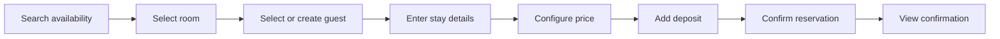
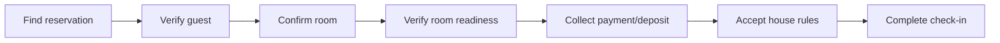
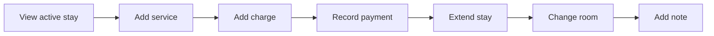
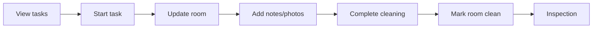
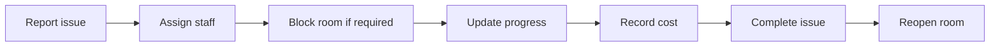

# User Workflows — Guest House Manager

| Item | Value |
|---|---|
| Document | `docs/redesign/user-workflows.md` |
| Phase | Phase 1 — Audit & Planning |
| Date | 2026-07-28 |
| Purpose | Map the seven core operational workflows before redesigning their screens, and annotate each step with what's real today vs. mocked vs. missing, so the redesign wires UI to actual capability instead of prettying up fiction. |
| Sources | Task brief §6 (workflow shape) · [source-brief](../source-brief.md) B15–B19, B24–B26 (authoritative step detail) · `current-ui-audit.md` Appendix A (backend readiness) |

Legend used in every table below:

- 🟢 **Live** — backend endpoint exists and does this today.
- 🟡 **Frontend-only** — a screen exists but only manipulates local mock state; no backend call.
- 🔴 **Missing** — neither frontend nor backend does this yet.

---

## 1. Reservation

| Step | Status | Detail |
|---|---|---|
| Search availability | 🔴 Missing | No `availability` engine exists on the backend (no overlap/double-booking check at all — `current-ui-audit.md` Appendix A). `app/(dashboard)/reservations/new/page.tsx` lets a user pick from the static `DEMO_ROOMS` list with no availability filtering. |
| Select room | 🟡 Frontend-only | Works against `DEMO_ROOMS`, not real inventory. |
| Select or create guest | 🟡 Frontend-only | `GuestController` supports search + create (🟢 for that part alone), but `reservations/new` doesn't call it. |
| Enter stay details | 🟡 Frontend-only | Dates/occupancy captured in local state only. |
| Configure price | 🟡 Frontend-only | `lib/pricing.ts` computes a price client-side; `conventions.md` §6 requires **all totals computed server-side** — this must change, not just be re-skinned. |
| Add deposit | 🔴 Missing | No deposit-specific flow on backend or frontend. |
| Confirm reservation | 🟢 (backend ready, frontend not wired) | `POST /api/v1/reservations` exists and works; the redesign should call it, not `toast.success()` a fake confirmation. |
| View confirmation | 🟡 Frontend-only | No confirmation PDF/document generation is wired (backend has no invoice/document-generation code path yet either). |

**Redesign implication:** rebuild this as the brief's §17 nine-section form (stay dates → room → guest → occupancy → rate → services → deposit → notes → review), call the real `POST /reservations` on submit, but the "availability" and "price" steps must visibly say the check is happening client-side-only today until the `availability`/`rate` backend domains exist — don't fabricate a "no conflicts found" message the backend never actually confirmed.

---

## 2. Check-In

Brief's simplified chain, annotated against the **real, working** `FrontDeskService.executeCheckIn()` and the fuller B15 12-step list:

| B15 step | Status | Detail |
|---|---|---|
| 1. Find reservation | 🟢 | `GET /api/v1/front-desk/arrivals` is real. `app/(dashboard)/check-in/page.tsx` currently lists `DEMO_ARRIVALS` instead. |
| 2. Confirm guest info | 🟡 | Reservation's guest data isn't fetched from the real `Guest` record in the check-in screen today. |
| 3. Add accompanying guests | 🔴 | No multi-guest-per-stay endpoint exists yet (`reservation_guests` table exists per schema; no API surface). |
| 4. Upload/verify identification | 🔴 | No `file` upload endpoint exists at all (Appendix A). |
| 5. Confirm room | 🟢 | Room existence/status check happens inside `executeCheckIn()`. |
| 6. Confirm arrival/departure dates | 🟢 | Read from the real `Reservation`. |
| 7. Review charges | 🟡 | Folio/charge totals are not server-computed on this screen yet — `PaymentService` exists for recording payments, but no folio-total endpoint is called here. |
| 8. Collect deposit or payment | 🟢 (backend ready) | `POST /api/v1/payments` works; not called from `check-in/page.tsx` today. |
| 9. Accept house rules | 🟡 | UI checkbox exists in the mock form; not persisted anywhere (no `houseRulesAccepted` field surfaced from `CheckIn` entity to the API yet — needs verification when wiring). |
| 10. Capture signature | 🔴 | No signature capture anywhere. |
| 11. Record key number | 🟢 | `CheckIn` entity has a key-number field and `FrontDeskService` persists it. |
| 12. Complete check-in | 🟢 | `POST /api/v1/front-desk/check-in` really flips `Reservation`→`CHECKED_IN` and `Room`→`OCCUPIED`, transactionally. This is one of the most backend-ready workflows in the whole system. |

**Blocking rules (B15):** room occupied/blocked/under-maintenance/out-of-service/dirty should block check-in unless overridden, with every override audited. `FrontDeskService` needs re-verification during Phase 7 for exactly which of these guards it currently enforces server-side versus which the redesign's UI must not assume are enforced — do not build a check-in screen that silently trusts client-side status text as the source of truth for "is this room really available."

**Redesign implication:** this is the highest-value wiring target in the whole app — real backend, currently 100% mocked frontend. Build as the brief's §21 step-based flow (reservation → guest verification → room readiness → charges/deposit → house rules → confirmation), call the real endpoints at steps 1, 5, 6, 8, 11, 12; clearly mark steps 3/4/10 (accompanying guests, ID upload, signature) as not-yet-available rather than fake-completing them.

---

## 3. In-House Stay

| Step | Status | Detail |
|---|---|---|
| View active stay | 🟢 | `GET /api/v1/front-desk/in-house` is real; `app/(dashboard)/in-house/page.tsx` shows `DEMO_IN_HOUSE` instead. |
| Add service | 🔴 | `service` (add-on) domain has zero backend (Appendix A). |
| Add charge | 🔴 | No `reservation:add_charge` implementation despite the permission key existing in the catalogue. |
| Record payment | 🟢 | `POST /api/v1/payments` works; not called from this screen. |
| Extend stay | 🔴 | No extend endpoint on `ReservationController` yet (create/view/cancel only). |
| Change room | 🔴 | No change-room endpoint yet. |
| Add note | 🔴 | No notes field/endpoint surfaced. |

**Redesign implication:** wire the "view" and "record payment" halves for real now; the "add service / add charge / extend / change room" actions need a visible, honest empty/disabled state with a short explanation (per the brief's own empty-state contract: "what's missing, why it matters, what to do next") rather than a working-looking button that quietly does nothing.

---

## 4. Check-Out

Brief's simplified chain against B19's fuller 18-step list and the real `FrontDeskService.executeCheckOut()`:

| B19 step | Status |
|---|---|
| 1–8. Open stay, review room/service charges, discounts, taxes, payments, calculate balance | 🟡 — no folio-total endpoint is called from the frontend; `FolioCalculator`-equivalent totals are not confirmed wired to this screen (verify in Phase 7). |
| 9. Record final payment or refund | 🟡 payment 🟢 / refund 🔴 — payments work, refunds have no backend at all. |
| 10. Return deposit | 🔴 |
| 11. Record key return | 🟢 — `CheckOut` entity supports it. |
| 12. Record room condition | 🟡 — captured in the mock UI only. |
| 13. Add checkout note | 🔴 |
| 14. Generate invoice | 🔴 — no code path creates an invoice (Appendix A); the one invoice in the system is a hardcoded seed row. |
| 15. Generate receipt | 🔴 — `Receipt` entity/repo exist; nothing ever creates or exposes one via API. |
| 16. Complete checkout | 🟢 — `POST /api/v1/front-desk/check-out` really flips `Reservation`→`CHECKED_OUT`. |
| 17. Mark room dirty | 🟢 — done inside the same transaction. |
| 18. Create housekeeping task | 🟡 — needs verification: `HousekeepingController` has no create-task endpoint per Appendix A, so this step may currently be schema-only even though the room-status flip is real. Re-verify at the top of Phase 7/8. |

**Redesign implication:** the brief's requirement that "the remaining balance must be very clear" and "prevent accidental completion" is achievable today for the parts that are real (payments, the check-out transition itself); invoice/receipt generation and refunds need an honest "not available in this build" treatment, not a fake PDF download button.

---

## 5. Housekeeping

| Step | Status |
|---|---|
| View tasks | 🟢 | `GET /api/v1/housekeeping/tasks` is real; `app/(dashboard)/housekeeping/page.tsx` shows `DEMO_TASKS`. |
| Start/complete task (status update) | 🟢 | `PUT /api/v1/housekeeping/tasks/{id}/status` is real. |
| Create/assign task | 🔴 | No create-task endpoint exists, despite `assigned_staff_id` existing on the table — this breaks the very first step of B19's "create housekeeping task" on checkout and the brief's own "assign/reassign" requirement. |
| Add notes/photos | 🔴 | No file upload endpoint exists at all. |
| Inspection | 🔴 | `housekeeping:inspect` permission key exists in the catalogue; no supporting endpoint. |

**Redesign implication:** the *task list + status update* loop (the daily bread-and-butter for housekeeping staff, per persona "Chan" in `product-requirements.md` §8.5) can be wired for real today. Task creation, photo evidence, and inspection need the honest-placeholder treatment. This module is a strong candidate for the brief's "housekeeping staff should not need to navigate through the full admin system" mobile-card-list requirement, independent of backend completeness.

---

## 6. Maintenance

This is the **most backend-complete operational workflow** found in the audit (`current-ui-audit.md` Appendix A: maintenance = FULLY BUILT):

| Step | Status |
|---|---|
| Report issue | 🟢 | `POST /api/v1/maintenance/issues` |
| Assign staff | 🟢 | Covered by issue fields (verify exact PATCH surface at implementation time). |
| Block room | 🟢 | `RoomController` supports blocking with a `RoomBlockReason`. |
| Update progress / record cost | 🟢 | Entity carries estimated/actual cost fields; `PUT /issues/{id}/resolve` is real. |
| Complete issue / reopen room | 🟢 | Resolve endpoint exists. |

**Redesign implication:** this module can be fully wired to real data in its very first redesign pass — it's the cleanest "redesign = also the real launch of this feature" case in the whole app. Prioritize it as an early proof that the new component set (StatusBadge, MetricCard, responsive Dialog) works end-to-end against real data before tackling the more partially-built domains.

---

## 7. Expense

| Step | Status |
|---|---|
| Create expense | 🟢 | `POST /api/v1/expenses` |
| Attach receipt | 🔴 | No file upload endpoint. |
| Submit | 🟢 | Part of create. |
| Review | 🟢 | `GET /api/v1/expenses` |
| Approve | 🟢 | `PUT /expenses/{id}/approve` |
| Reject | 🔴 | No reject endpoint (approve-only today). |
| Include in reports | 🟡 | `ReportController` exposes one financial report; verify at implementation time whether it actually folds in expense data or only revenue. |

**Redesign implication:** create/review/approve can be wired for real now (and the current search bug on this exact page — non-functional filter, `current-ui-audit.md` §9 — should be fixed as part of this same pass, not left for later). Receipt attachment and rejection need the honest-placeholder treatment.

---

## Cross-workflow observations for the roadmap

1. **Check-in and maintenance are the two workflows where "redesign the screen" and "ship the first real feature" are the same unit of work** — prioritize them early to prove the new component set against real data before spending effort on domains that are still backend-incomplete.
2. **Every workflow that touches money beyond a simple payment record (deposits, refunds, invoices, receipts) is backend-incomplete.** The redesign must not paper over this with a convincing-looking UI — per the brief's own B31 PWA rule ("never offline: final payments, refunds... other sensitive financial operations"), financial screens should fail loud and honest, not quiet and fake.
3. **File upload (photos, receipts, ID documents) blocks a piece of nearly every workflow** (check-in ID, check-out room-condition photos, housekeeping before/after photos, maintenance photos, expense receipts) and has zero backend support today. This is worth flagging to the project owner as a high-leverage single backend feature to prioritize alongside the frontend redesign, since it currently caps the ceiling of six of seven workflows above.
